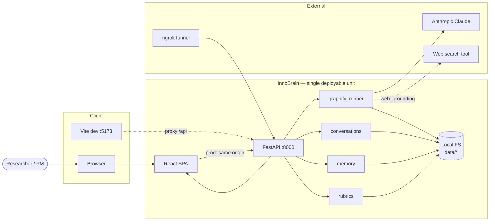
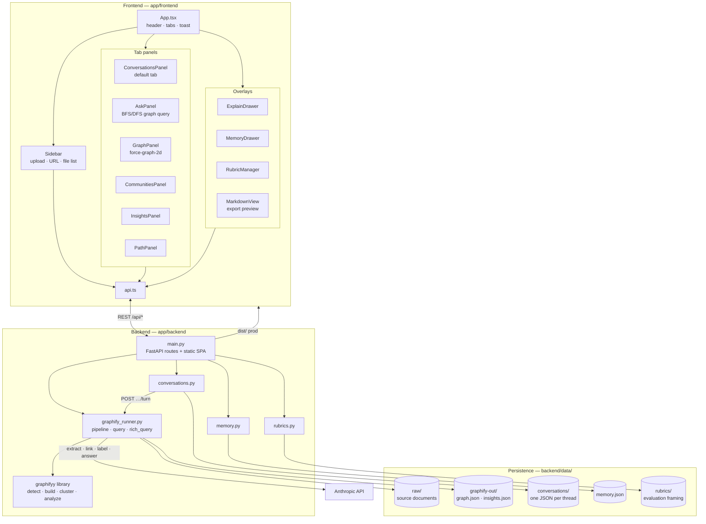
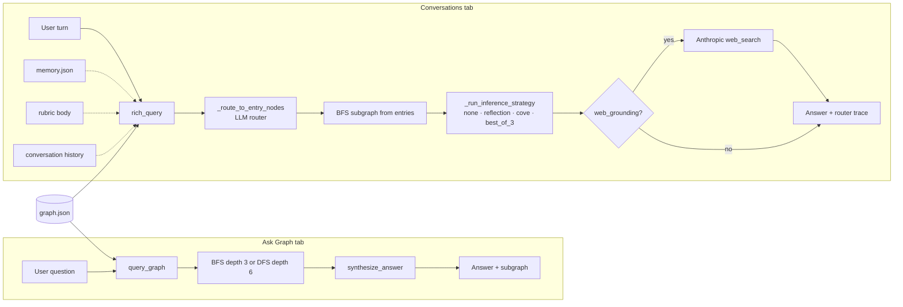
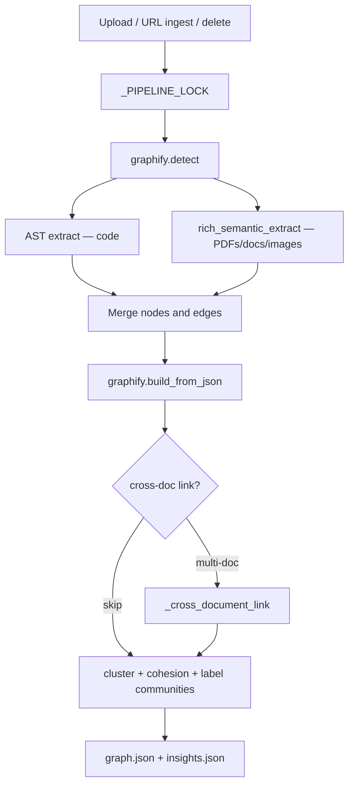
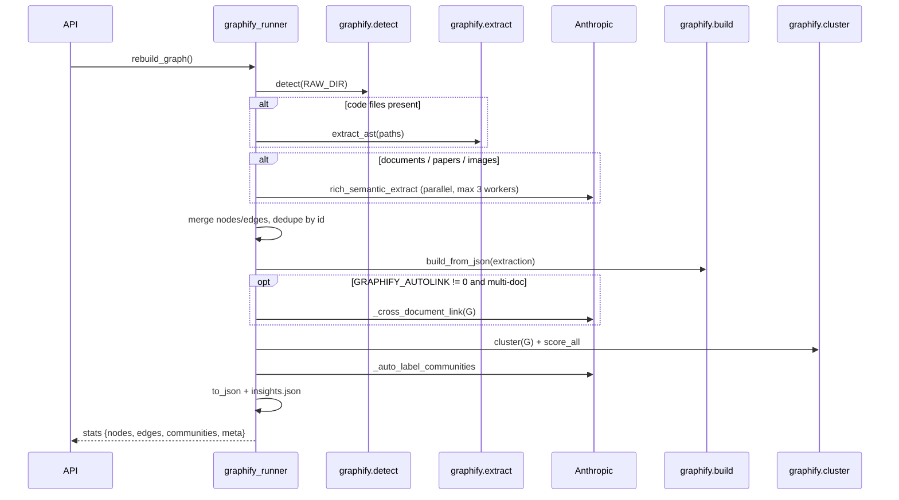
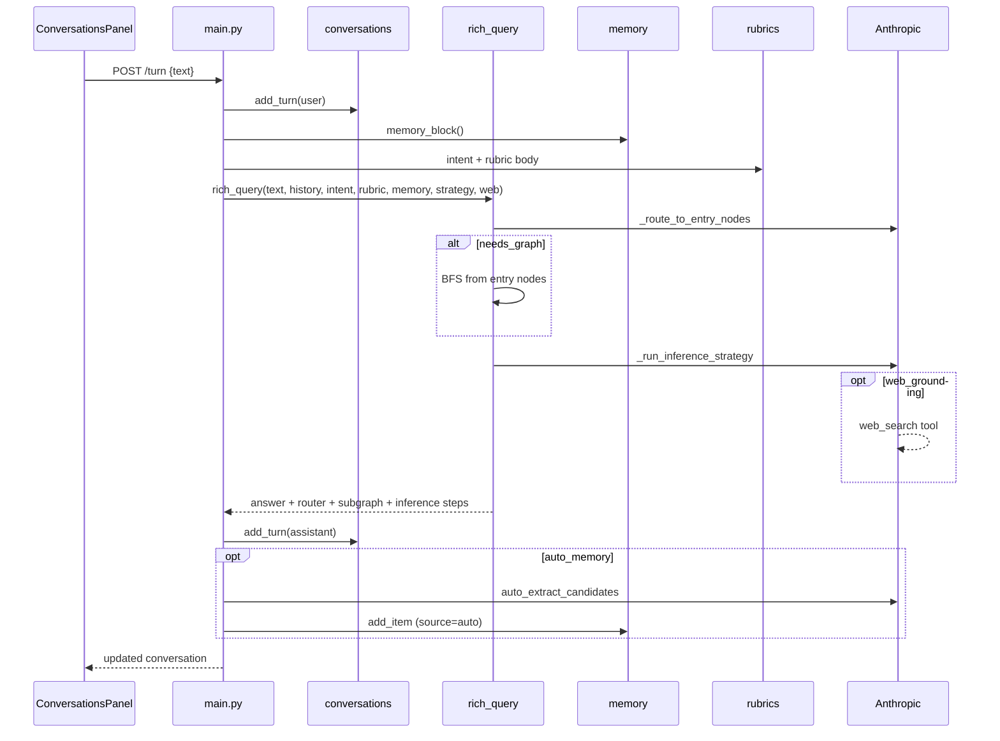

# InnoBrain (graphify web) — Application Architecture

## 1. Overview

**InnoBrain** is a browser-based knowledge-graph application. Users upload documents (PDFs, markdown, images, code, URLs); the system extracts entities and relationships, clusters them into communities, and exposes interactive exploration. The primary surface is **Conversations** — threaded chat with graph-grounded answers, rubrics, persistent memory, and optional web grounding — alongside graph visualization, path finding, and one-shot Ask Graph queries.

The product name in the UI is **InnoBrain**; the repository and package names use **graphify web**.

| Concern | Approach |
|--------|----------|
| Deployment model | Monolith: FastAPI serves REST API + static React build |
| Intelligence | Anthropic Claude for extraction, linking, labeling, and answer synthesis |
| Graph engine | `graphifyy` Python library (detect → extract → build → cluster → analyze) |
| Persistence | Local filesystem under `backend/data/` (no database) |
| Public access | Optional ngrok tunnel to port 8000 |

---

## 2. System Context



**Actors**

- **End user** — uploads docs, asks questions, explores graph in the browser.
- **Anthropic API** — semantic extraction, cross-document linking, community labels, synthesized answers.
- **graphifyy package** — deterministic pipeline stages (file detection, AST extraction for code, graph build, Louvain clustering, insight heuristics).

---

## 3. High-Level Architecture

### 3.1 Component diagram



### 3.2 Query paths

Two distinct Q&A paths serve different UI surfaces:



### 3.3 Ingest and rebuild flow



**Layer responsibilities**

| Layer | Role |
|-------|------|
| **Presentation** | React components, tab navigation, toast UX, `react-force-graph-2d` visualization |
| **API** | HTTP boundary, validation (Pydantic), CORS, SPA fallback routing |
| **Domain / pipeline** | `graphify_runner`: orchestrates graphify + custom Claude prompts |
| **Storage** | Raw uploads and serialized graph + precomputed insights |

---

## 4. Technology Stack

### Backend

| Package | Version | Purpose |
|---------|---------|---------|
| FastAPI | 0.115.6 | HTTP API, OpenAPI at `/docs` |
| uvicorn | 0.34.0 | ASGI server |
| graphifyy | ≥0.8.2 | Core graph pipeline (`graphify.*` imports) |
| anthropic | ≥0.40.0 | Claude Messages API |
| python-dotenv | 1.0.1 | `.env` configuration |
| truststore | ≥0.10.0 | OS trust store for corporate TLS proxies |
| networkx | (transitive) | In-memory graph, shortest paths |

### Frontend

| Package | Purpose |
|---------|---------|
| React 18 | UI framework |
| TypeScript 5.6 | Typed client |
| Vite 5 | Dev server, HMR, production build |
| react-force-graph-2d | Interactive 2D force-directed graph |

### Runtime

- Python 3.10+ (truststore behavior noted in `main.py`)
- Node.js (frontend build only)

---

## 5. Backend Architecture

### 5.1 Entry point — `main.py`

- Instantiates `FastAPI` with permissive CORS (`allow_origins=["*"]`) for Vite dev on port 5173.
- Loads `.env` before importing `graphify_runner` so `ANTHROPIC_API_KEY` is available.
- Registers REST routes under `/api/*`.
- Serves built frontend from `app/frontend/dist`:
  - `/assets/*` → static bundle
  - `/{path}` → SPA fallback to `index.html` (API routes take precedence)

### 5.2 Pipeline orchestration — `graphify_runner.py`

Central module; the API stays thin by delegating here.

**Concurrency control**

- `_PIPELINE_LOCK` (threading) serializes full rebuilds and relink operations to prevent races on `graph.json`.

**Directory layout**

```
backend/data/
├── raw/                 # Uploaded / ingested source files (gitignored)
├── graphify-out/
│   ├── graph.json       # NetworkX node-link export
│   └── insights.json    # gods, surprises, questions, communities metadata
├── conversations/       # One JSON file per conversation thread
├── memory.json          # Durable facts injected into every conversation turn
└── rubrics/             # Reusable evaluation framing (e.g. Appfire context)
```

### 5.3 Graph rebuild pipeline

Triggered on upload, delete, URL ingest, and optionally via manual relink.



**Extraction modes**

| Source type | Method | Cost |
|-------------|--------|------|
| Code | `graphify.extract` (AST) | Free, deterministic |
| PDF, markdown, images, papers | `rich_semantic_extract` via Claude | Token-based |
| Default graphify LLM path | **Not used** — bypassed because v0.8.2 emits only document-level nodes |

**Rich extraction schema** (per document)

- Nodes: `id`, `label`, `source_file`, `file_type`, provenance fields
- Edges: `relation`, `confidence` (EXTRACTED \| INFERRED \| AMBIGUOUS), `confidence_score`
- Optional hyperedges (3+ nodes, max 3 per doc)
- PDFs/images sent as base64 document/image blocks; text capped at ~80k chars

**Post-build enrichment**

1. **Cross-document link** (`_cross_document_link`) — Claude proposes `same_as` / `semantically_similar_to` pairs across files; adds INFERRED edges in-place.
2. **Community detection** — Louvain via `graphify.cluster`.
3. **Community labeling** — Haiku (default) names each community from member labels.
4. **Insights** — `god_nodes`, `surprising_connections`, `suggest_questions` written to `insights.json`.

### 5.4 Query and reasoning

| Operation | Algorithm | LLM |
|-----------|-----------|-----|
| `/api/query` | Tokenize question → score node labels → BFS (depth 3) or DFS (depth 6) → subgraph + `rendered` text | Optional `synthesize_answer` (Haiku) |
| `/api/explain` | Fuzzy label match → 1-hop neighborhood | Haiku explanation |
| `/api/path` | `networkx.shortest_path` between fuzzy-matched nodes | None |
| `/api/relink` | Re-run cross-document linker only; re-cluster + re-label | Sonnet (linker) |

**Query fallback** — If no terms match any node label, traversal starts from top-degree “god” nodes and sets `fallback_used: true`.

### 5.5 Conversation turns — `rich_query`

Used exclusively by `POST /api/conversations/{id}/turn` (not the Ask Graph tab).



| Setting | Effect |
|---------|--------|
| `intent` | System-prompt style (explore, decide, challenge, etc.) |
| `rubric_id` | Appends rubric body (e.g. Appfire capital/Sherlocking rules) |
| `inference_strategy` | `none`, `reflection`, `cove`, `best_of_3` |
| `web_grounding` | Enables Anthropic `web_search` for time-sensitive claims |
| `auto_memory` | After each turn, LLM may append durable facts to `memory.json` |

---

## 6. Frontend Architecture

### 6.1 Application shell — `App.tsx`

- **State**: stats, document list, insights, active tab, upload/relink busy flags, toast, explain drawer, community focus for graph filter.
- **Layout**: header (stats pills + “Link docs”), left `Sidebar`, main tab content, `ExplainDrawer` overlay.
- **Data refresh**: `refresh()` loads `/api/stats`, `/api/docs`, `/api/insights` in parallel after mutations.

### 6.2 Tab panels

| Tab | Component | Primary API |
|-----|-----------|-------------|
| Conversations (default) | `ConversationsPanel` | `POST /api/conversations/{id}/turn` → `rich_query` |
| Ask Graph | `AskPanel` | `POST /api/query` → `query_graph` |
| Graph | `GraphPanel` | `GET /api/graph` |
| Communities | `CommunitiesPanel` | `GET /api/communities` |
| Insights | `InsightsPanel` | `GET /api/insights` |
| Path | `PathPanel` | `POST /api/path` |

**Cross-cutting UX**

- **Conversations** — intent presets, rubric attachment, inference strategy (reflection / chain-of-verification / best-of-3), pins, executive Markdown export, `MemoryDrawer` and `RubricManager`.
- Node clicks open `ExplainDrawer` → `POST /api/explain` (all tabs).
- Insights suggested questions prefill Ask Graph tab.
- Communities panel can focus graph on a community ID.

### 6.3 API client — `api.ts`

- Typed wrappers around `fetch`.
- Production: same-origin `/api/*` (served by FastAPI).
- Development: Vite proxy forwards `/api` → `http://localhost:8000`.

### 6.4 Visualization — `GraphPanel`

- Loads full graph JSON once on mount.
- `react-force-graph-2d` with community-based node colors (`communityColor` palette).
- ResizeObserver for responsive canvas; optional community focus zoom.

---

## 7. API Reference

| Method | Path | Description |
|--------|------|-------------|
| GET | `/api/health` | Liveness `{"status":"ok"}` |
| GET | `/api/stats` | Node/edge/community/file counts |
| GET | `/api/docs` | List files in `data/raw/` |
| POST | `/api/upload` | Multipart files → save → `rebuild_graph()` |
| DELETE | `/api/docs/{filename}` | Delete file → rebuild |
| POST | `/api/query` | Body: `{question, mode, synthesize, budget}` |
| GET | `/api/insights` | Precomputed graph insights |
| GET | `/api/communities` | Labeled communities with member nodes |
| POST | `/api/explain` | Body: `{node}` — neighborhood + explanation |
| POST | `/api/path` | Body: `{source, target}` — shortest path |
| POST | `/api/ingest-url` | Body: `{url, author?, contributor?}` |
| POST | `/api/relink` | Cross-document link without re-extraction |
| GET | `/api/graph` | Full `graph.json` (nodes + links) |
| GET/POST | `/api/conversations` | List / create threads |
| GET/PATCH/DELETE | `/api/conversations/{id}` | Get / rename / delete thread |
| PATCH | `/api/conversations/{id}/settings` | Intent, rubric, inference, web grounding, auto-memory |
| POST | `/api/conversations/{id}/turn` | User message → `rich_query` → assistant turn |
| POST/DELETE | `/api/conversations/{id}/pin[/{pin_id}]` | Pin nodes, answers, or notes |
| POST | `/api/conversations/{id}/export` | Executive Markdown report |
| GET/POST/PATCH/DELETE | `/api/memory[/{id}]` | Persistent memory items |
| GET | `/api/intents` | Conversation intent labels |
| GET/POST/PATCH/DELETE | `/api/rubrics[/{id}]` | Evaluation rubrics |

**Upload limits**

- Max 50 MB per file
- Empty files skipped

**OpenAPI**

- Interactive docs at `http://localhost:8000/docs` when backend is running.

---

## 8. Data Model

### 8.1 Graph node (persisted)

```json
{
  "id": "mydoc_some_entity",
  "label": "Human-readable concept name",
  "file_type": "document",
  "source_file": "report.pdf",
  "source_location": null,
  "community": 3,
  "community_label": "Index Architecture & Hybrid Moat"
}
```

### 8.2 Graph edge (persisted as `links`)

```json
{
  "source": "node_a",
  "target": "node_b",
  "relation": "semantically_similar_to",
  "confidence": "INFERRED",
  "confidence_score": 0.85,
  "source_file": "report.pdf",
  "weight": 1.0
}
```

**Relation types** (extraction prompt): `references`, `cites`, `conceptually_related_to`, `shares_data_with`, `semantically_similar_to`, `rationale_for`, `implements`, `calls`, plus linker `same_as`.

### 8.3 Insights (`insights.json`)

| Field | Content |
|-------|---------|
| `communities` | `community_id → [node_ids]` |
| `community_labels` | `community_id → title` |
| `cohesion` | Per-community cohesion score |
| `gods` | Highest-degree nodes |
| `surprises` | Cross-community inferred edges |
| `questions` | Suggested natural-language questions |

### 8.4 Query response (ephemeral)

- `subgraph`: nodes/edges from traversal with relevance scores
- `rendered`: token-budgeted text for LLM or display
- `answer`: optional synthesized prose
- `fallback_used`: boolean when god-node anchoring was used

---

## 9. Configuration

Environment variables (see `backend/.env.example`):

| Variable | Default | Purpose |
|----------|---------|---------|
| `ANTHROPIC_API_KEY` | — | Required for PDF/doc extraction and LLM features |
| `GRAPHIFY_MODEL` | `claude-sonnet-4-6` | Per-document semantic extraction |
| `GRAPHIFY_MAX_OUTPUT_TOKENS` | `16000` | Extraction output cap |
| `GRAPHIFY_CONCURRENCY` | `3` | Parallel extraction workers |
| `GRAPHIFY_AUTOLINK` | `1` | Run cross-doc linker on rebuild (`0` to disable) |
| `GRAPHIFY_LINK_MODEL` | `claude-sonnet-4-6` | Cross-document linker |
| `GRAPHIFY_LINK_MAX_TOKENS` | `8000` | Linker output cap |
| `GRAPHIFY_LABEL_MODEL` | `claude-haiku-4-5-20251001` | Community titles |
| `GRAPHIFY_ANSWER_MODEL` | `claude-haiku-4-5-20251001` | Q&A and explain synthesis |
| `PORT` | `8000` | uvicorn listen port |

---

## 10. Deployment Topologies

### 10.1 Production-like (single process)

```bash
cd app/frontend && npm run build
cd app/backend && python3 main.py
# → http://localhost:8000 (API + static UI)
ngrok http 8000   # optional public URL
```

### 10.2 Development (split ports)

| Process | Port | Role |
|---------|------|------|
| `python3 main.py` | 8000 | API only (or API + stale dist) |
| `npm run dev` | 5173 | Vite HMR; proxies `/api` → 8000 |

### 10.3 Artifact flow

```
Source docs → data/raw/
           → [pipeline] → graphify-out/graph.json
           → [pipeline] → graphify-out/insights.json
Frontend build → frontend/dist/ → served at /
```

---

## 11. Security and Operational Notes

| Topic | Current behavior | Hardening consideration |
|-------|------------------|-------------------------|
| Authentication | None | Add auth before public ngrok exposure |
| CORS | `*` | Restrict origins in production |
| File upload | Basename sanitization, 50 MB cap | Virus scan, MIME validation if untrusted users |
| Secrets | `ANTHROPIC_API_KEY` in `.env` | Never commit; use secret manager in cloud deploy |
| Data isolation | Single-tenant local FS | Multi-tenant would need per-user data paths |
| Pipeline cost | ~60s/PDF, token usage returned in upload meta | Rate-limit uploads; cache extractions by file hash |
| TLS | `truststore` for corporate proxies | Standard for managed Python deployments |

**Failure modes**

- Missing API key: semantic extraction skipped; error surfaced in upload `meta.error`.
- Truncated LLM JSON: `_parse_extraction_json` attempts brace/bracket recovery.
- Concurrent uploads: serialized by `_PIPELINE_LOCK` (second request waits).

---

## 12. Extension Points

| Goal | Likely touchpoints |
|------|-------------------|
| New file types | `graphify.detect` + `_extract_one` in `graphify_runner.py` |
| Different LLM provider | Replace `Anthropic` client calls; keep JSON schema contract |
| Persistent multi-user storage | Replace `DATA_DIR` with DB/blob store; add auth middleware in `main.py` |
| Real-time graph updates | WebSocket from backend after pipeline; invalidate `GraphPanel` cache |
| Embedding / vector search | New index alongside NetworkX; extend `query_graph` start-node selection |
| Deploy to cloud | Container with `PORT`, volume for `data/`, secret injection for API key |

---

## 13. Repository Layout (application scope)

```
app/
├── ARCHITECTURE.md          # This document
├── README.md                # Setup and run instructions
├── backend/
│   ├── main.py              # FastAPI app + static mount
│   ├── graphify_runner.py   # Pipeline + query_graph + rich_query
│   ├── conversations.py     # Thread CRUD (JSON per file)
│   ├── memory.py            # Persistent memory store
│   ├── rubrics.py           # Evaluation rubrics + intent labels
│   ├── requirements.txt
│   ├── .env.example
│   └── data/                # Runtime data (gitignored)
│       ├── raw/
│       ├── graphify-out/
│       ├── conversations/
│       ├── memory.json
│       └── rubrics/
└── frontend/
    ├── src/
    │   ├── App.tsx
    │   ├── api.ts
    │   └── components/      # Panels, ExplainDrawer, MemoryDrawer, RubricManager
    ├── vite.config.ts
    └── dist/                # Production build output
```

**Related assets outside `app/`**

- `graphify-out/` at repo root — sample/offline graphify CLI output (reference corpus for Appfire strategy docs).
- Graphify skill (`~/.claude/skills/graphify`) — CLI workflow that informed the rich extraction prompts in `graphify_runner.py`.

---

## 14. Glossary

| Term | Meaning |
|------|---------|
| **God node** | High-degree hub; bridge between communities |
| **Community** | Louvain cluster of related concepts |
| **INFERRED edge** | Model-reasoned link (not verbatim in source) |
| **Cross-document link** | Post-extraction pass aligning entities across files |
| **Relink** | User-triggered re-run of cross-document linker without re-extraction |
| **BFS / DFS query** | Subgraph expansion from term-matched (or fallback) seed nodes |

---

*Document version: 1.1 — aligned with codebase as of May 2026.*
