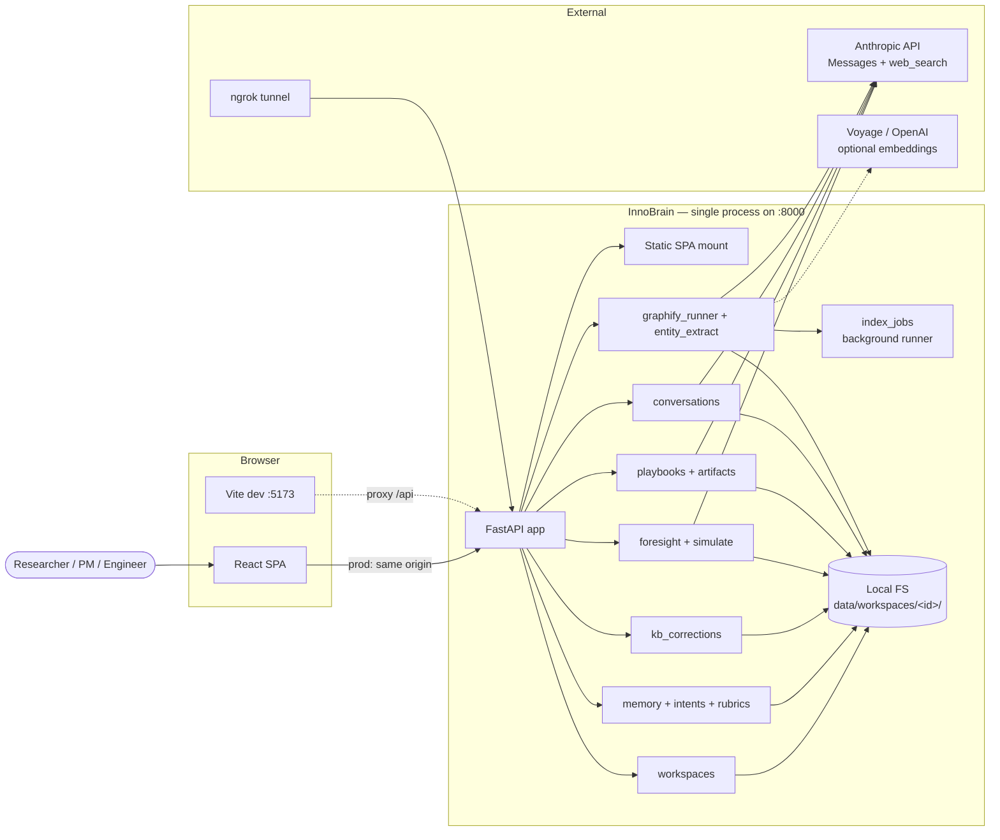
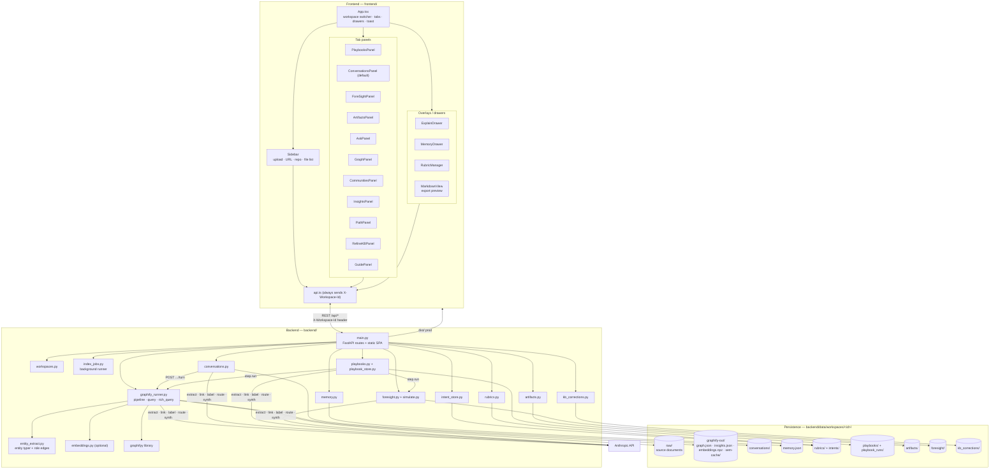
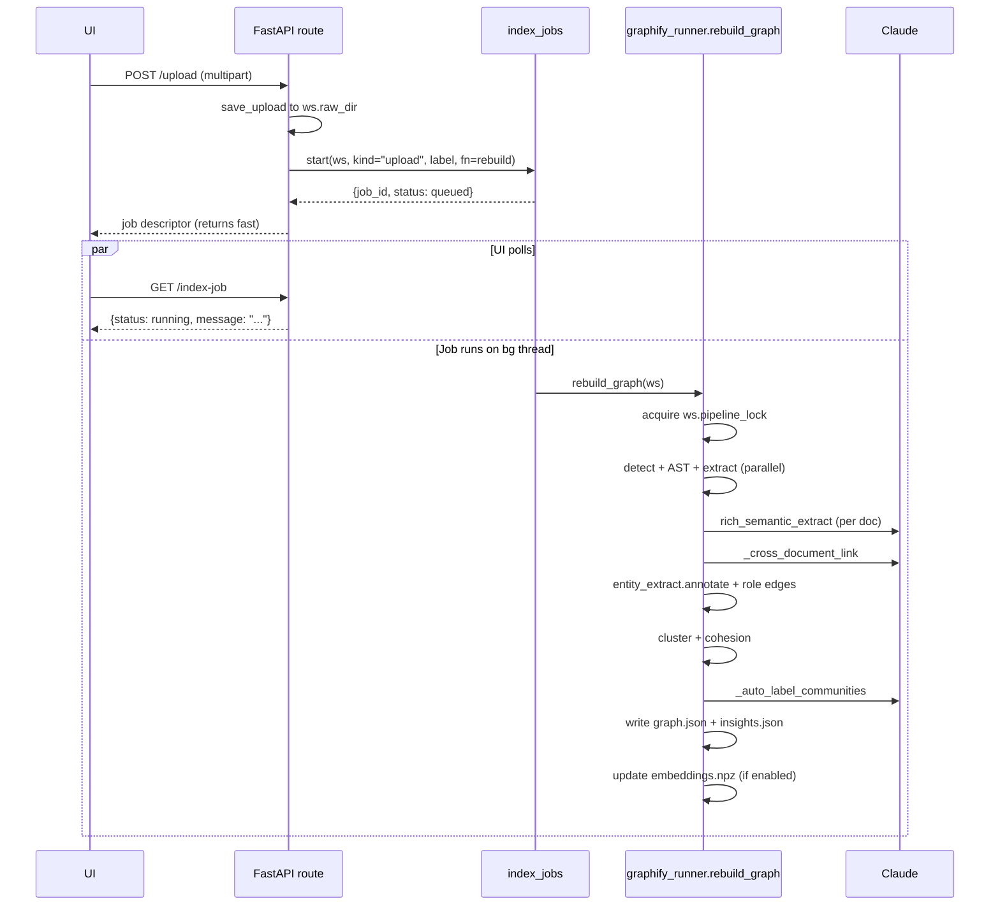
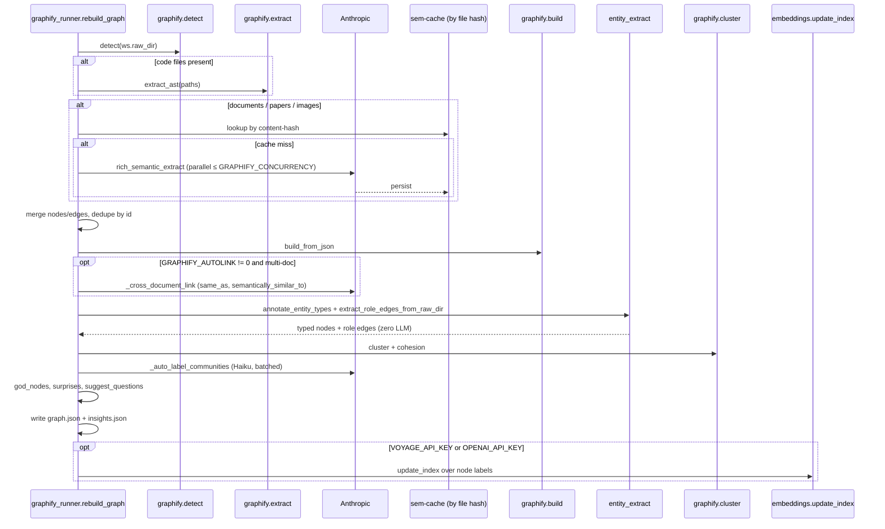
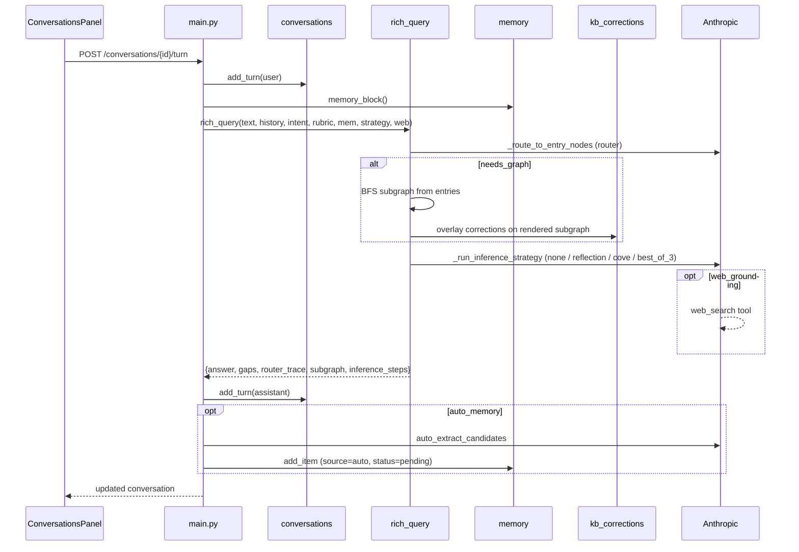

# InnoBrain (graphify web) — Application Architecture

## 1. Overview

**InnoBrain** is a single-deployable knowledge-graph workbench. A FastAPI
backend extracts a graph from uploaded documents / URLs / code repos and
serves a React SPA that lets users explore it, chat with it, run multi-step
playbooks against it, and refine it by hand. Everything is local-first:
data lives on the filesystem under `backend/data/`, scoped per workspace.

The product brand in the UI is **InnoBrain**; the codebase + npm package
trace back to a prior name, **graphify web**. The GitHub repo is
[`appfire-team/inno-brain`](https://github.com/appfire-team/inno-brain).

| Concern | Approach |
|---------|----------|
| Deployment model | Monolith — FastAPI serves REST API at `/api/*` + static React build |
| Intelligence | Anthropic Claude (extract, link, label, route, synthesize, refine) |
| Graph engine | `graphifyy` Python library (detect → extract → build → cluster → analyze) + post-pass deterministic entity typing |
| Persistence | Local filesystem; per-workspace JSON trees under `backend/data/` |
| Isolation | First-class **Workspaces** — each owns its own corpus + graph + history |
| Concurrency | Long pipeline runs delegated to a per-workspace background job (`index_jobs`) |
| Public access | Optional ngrok tunnel to port 8000 |

---

## 2. System Context



**Actors**

- **End user** — uploads docs, asks questions, runs playbooks, refines graph.
- **Anthropic API** — semantic extraction, cross-document linking, community labels, conversation routing, synthesized answers, playbook step execution, ForeSight persona responses, optional `web_search` tool calls.
- **graphifyy package** — deterministic pipeline stages (file detection, AST extraction for code, graph build, Louvain clustering, insight heuristics).
- **Voyage or OpenAI** — optional embedding provider for the semantic-vector index used as fallback retrieval.

---

## 3. High-Level Architecture

### 3.1 Component diagram



### 3.2 Workspace model

Every request is scoped to a **Workspace**. The `active_workspace`
dependency reads the `X-Workspace-Id` header; if absent, the most-recently-
updated workspace wins. A `default` workspace is created on first boot
(legacy pre-workspace data, if any, is migrated into it).

A `Workspace` is just a path container with a per-workspace pipeline lock:

```
data/workspaces/<ws-id>/
├── workspace.json         # {id, name, created_at, updated_at, source_workspace_id}
├── raw/                   # source corpus
├── graphify-out/          # graph.json, insights.json, embeddings.npz, sem-cache/
├── conversations/         # one JSON per thread
├── artifacts/             # typed playbook outputs + manual notes
├── playbook_runs/         # in-flight + completed runs
├── foresight/             # scenario sessions
├── rubrics/               # workspace-scoped + overrides
├── intents/               # workspace-scoped + overrides
├── playbooks/             # workspace-scoped + overrides
├── kb_corrections/        # human refinements (Fix / Add / Confirm / Doubt)
└── memory.json            # durable facts injected into every turn
```

Cross-workspace shared stores live at the root: `global_intents/`,
`global_playbooks/`, `foresight_personas/`. New workspaces can be **cloned**
from an existing one (`source_workspace_id` deep-copies the corpus + graph
but not conversations).

### 3.3 Query paths

Two distinct Q&A paths serve different UI surfaces — *deliberately not
merged*. Ask Graph is the lightweight surface; Conversations is the full one.

```mermaid
flowchart LR
    subgraph ask_tab ["Ask Graph tab"]
        Q1[User question] --> QG[query_graph]
        QG --> BFS["BFS depth 3 or DFS depth 6"]
        BFS --> Syn1[synthesize_answer + gaps]
        Syn1 --> A1[Answer + subgraph]
    end

    subgraph conv_tab ["Conversations tab"]
        Q2[User turn] --> RQ[rich_query]
        RQ --> RT["_route_to_entry_nodes<br/>LLM router"]
        RT --> BFS2[BFS subgraph from entries]
        BFS2 --> OV[kb_corrections overlay]
        OV --> INF["_run_inference_strategy<br/>none · reflection · cove · best_of_3"]
        INF --> WG{web_grounding?}
        WG -->|yes| WS[Anthropic web_search tool]
        WG -->|no| A2[Answer + gaps + router trace]
        WS --> A2
        MemR[memory.json] -.-> RQ
        RubR[rubric body] -.-> RQ
        Hist[conversation history] -.-> RQ
    end

    G[(graph.json)] --> QG & RQ
    Rel[/api/entities/relations] -.->|"deterministic, no LLM"| G
```

### 3.4 Ingest and rebuild — background-job flow

Every route that mutates the corpus (`upload`, `delete`, `ingest-url`,
`ingest-repo`, `rebuild`, `relink`, `research`) returns immediately and
hands the actual work to `index_jobs`. The UI polls `/api/index-job` and
shows a banner.



**Notes**

- `_start_rebuild_job(ws, kind, label)` returns `HTTPException(409)` if the
  workspace already has a job in flight.
- The pipeline lock lives **on the workspace** — concurrent uploads to
  *different* workspaces don't block each other; concurrent uploads to the
  *same* workspace serialize.
- On startup, any orphan runs left by a prior process are swept to
  `failed` by `index_jobs.cleanup_orphaned_runs()`.

### 3.5 Layer responsibilities

| Layer | Role |
|-------|------|
| **Presentation** | React tabs + panels, `react-force-graph-2d`, drawers, toast UX, in-app guides |
| **API** | HTTP boundary, Pydantic validation, `active_workspace` dependency, CORS, SPA fallback |
| **Domain** | `graphify_runner`, `playbooks`, `foresight`, `artifacts`, `kb_corrections` — orchestrate Claude + graph |
| **Background jobs** | `index_jobs` — serializes long work per workspace; UI polls for status |
| **Storage** | Per-workspace JSON trees on local FS; no DB |

---

## 4. Technology Stack

### Backend

| Package | Purpose |
|---------|---------|
| FastAPI | HTTP API, OpenAPI at `/docs` |
| uvicorn | ASGI server (reload mode default; toggle with `UVICORN_NO_RELOAD=1`) |
| graphifyy ≥0.8.2 | File detection, AST extraction for code, graph build, Louvain clustering, insight heuristics |
| anthropic ≥0.40.0 | Claude Messages API (incl. `web_search` tool) |
| python-dotenv | `.env` configuration |
| truststore ≥0.10.0 | OS trust store for corporate TLS proxies (Netskope, ZScaler) |
| networkx | In-memory graph, shortest paths |
| numpy | Embedding index (when enabled) |

### Frontend

| Package | Purpose |
|---------|---------|
| React 18 | UI framework |
| TypeScript 5.6 | Typed client |
| Vite 5 | Dev server, HMR, production build |
| react-force-graph-2d | Interactive 2D force-directed graph |
| react-markdown + mermaid + katex | Rich answer rendering (markdown, diagrams, math) |

### Runtime

- Python 3.10+ (truststore behavior noted in `main.py`)
- Node.js 18+ (frontend build only)

---

## 5. Backend Modules

Source of truth for what each Python module does and what it owns on disk.

| Module | Responsibility | On-disk artifacts |
|--------|---------------|-------------------|
| `main.py` | FastAPI app, route registration, `active_workspace` dep, static SPA mount, `_start_rebuild_job` helper, model-picker registry (`ANSWER_MODELS`) | Serves `frontend/dist/` |
| `workspaces.py` | Workspace CRUD, per-workspace pipeline lock, legacy-data migration | `data/workspaces/<id>/workspace.json` |
| `graphify_runner.py` | Pipeline orchestration: `rebuild_graph`, `rich_semantic_extract`, `_cross_document_link`, `_auto_label_communities`, `query_graph`, `rich_query`, `_route_to_entry_nodes`, `_run_inference_strategy`, `synthesize_answer` + gap parser, `explain_node`, `find_path`, `link_documents` | `graphify-out/graph.json`, `insights.json`, `embeddings.npz`, `sem-cache/` |
| `entity_extract.py` | Deterministic, zero-LLM entity typing (Person / Company / Organization / Product) + role-edge extraction (`works_at`, `founded`, `invested_in`, `attended`, `advises`) | Modifies graph in place during rebuild |
| `index_jobs.py` | Per-workspace background job tracker — `start`, `get_job`, `request_cancel`, `cleanup_orphaned_runs`, `is_busy` | In-memory state only |
| `conversations.py` | Threaded chat store — turns, pins, settings (intent, rubric, inference strategy, web grounding, auto-memory), Markdown export, scenario synthesis | `conversations/<id>.json` |
| `memory.py` | Durable per-workspace facts prepended to every turn's system prompt; `auto_extract_candidates` proposes new memory items post-turn | `memory.json` |
| `rubrics.py` | Built-in evaluation rubrics + built-in intent labels (60+ in intent groups) and the `intent_instruction` lookup | Built-in defaults in code |
| `intent_store.py` | Workspace + global override store for user-defined intents (cascades built-in → workspace → global) | `intents/`, `global_intents/` |
| `playbooks.py` | Multi-step workflow engine — built-in playbook registry, run state machine (steps include `intent_turn`, `foresight`, `simulate`, `factcheck`, `synthesize`), background runner, resume + cancel, reviewer-comment refinement | `playbook_runs/<run-id>.json` |
| `playbook_store.py` | Workspace + global override store for user-defined / customized playbooks (cascade like intents) | `playbooks/`, `global_playbooks/` |
| `artifacts.py` | Typed outputs from playbooks (e.g. `OpportunityScan`, `PRDDraft`, `BuildBuyDecision`, `LaunchPlan`, …); per-artifact Q&A, simplification, versioning, comment threads, suggest-patch / refine | `artifacts/<id>.json` |
| `foresight.py` | Heavy-weight multi-persona (1–12) scenario sessions with multi-round debate + position updates across horizons; persona overrides | `foresight/<id>.json`, `foresight_personas/` |
| `simulate.py` | Lightweight 4-persona (bull, bear, customer, competitor) inline scenario inside a conversation; results persisted as conversation turns | none |
| `kb_corrections.py` | Human refinements on graph nodes/edges — Fix / Add / Confirm / Doubt — overlaid at read time; never mutates `graph.json` | `kb_corrections/<id>.json` |
| `embeddings.py` | Optional vector index over node labels (Voyage or OpenAI) — `update_index`, `top_k`, `index_stats` | `graphify-out/embeddings.npz`, `embeddings.meta.json` |

---

## 6. Pipeline Deep Dive

Triggered by `rebuild_graph(ws)` on upload, delete, URL ingest, repo ingest,
manual `/rebuild`, and `/relink`. Serialized by `ws.pipeline_lock`.



**Extraction modes**

| Source type | Method | LLM call? |
|-------------|--------|-----------|
| Code (Python, JS/TS, …) | `graphify.extract` AST walk | No |
| PDF, markdown, images, papers, HTML | `rich_semantic_extract` via Claude | Yes (per doc, parallel) |
| Entity typing | Heuristics: regex + word lists | No |
| Role edges (`works_at`, …) | Regex over plain-text raw files | No |

**Rich extraction schema** (per document)

- Nodes: `id`, `label`, `source_file`, `file_type`, provenance fields, optional `entity_type`
- Edges: `relation`, `confidence` (`EXTRACTED` / `INFERRED` / `AMBIGUOUS`), `confidence_score`, `weight`
- Optional hyperedges (3+ nodes, max 3 per doc)
- PDFs/images sent as base64 `document` / `image` blocks; text capped at ~80k chars

**Semantic cache** — each per-file extraction is cached under
`sem-cache/<hash>.json`, keyed by file content hash + extraction model.
Removing a file invalidates only its cache entry.

---

## 7. Query and Reasoning

### 7.1 `query_graph` — Ask Graph tab

Tokenize question → score node labels → BFS (depth 3) or DFS (depth 6) →
optional `synthesize_answer` (Haiku by default). One-shot, no history.
If no terms match, traversal starts from top-degree "god" nodes and the
response sets `fallback_used: true`.

### 7.2 `rich_query` — Conversations tab



| Conversation setting | Effect |
|---|---|
| `intent_id` | System-prompt framing (explore, decide, challenge, devil's-advocate, …) — sourced from `rubrics.INTENT_LABELS` + `intent_store` overrides |
| `rubric_id` | Appends rubric body (e.g. company constraints, scoring criteria) |
| `inference_strategy` | `none`, `reflection` (draft → critique → revise), `cove` (chain-of-verification), `best_of_3` (sample → pick) |
| `web_grounding` | Enables Anthropic `web_search` for time-sensitive claims |
| `auto_memory` | After each turn, LLM may propose durable facts; user accepts/edits in the memory drawer |
| `answer_model` | Per-thread override (Haiku 4.5 / Sonnet 4.6 / Opus 4.7) |

### 7.3 Gap parser

Both `query_graph` and `rich_query` enforce a `<gaps>…</gaps>` block at
the end of the synthesizer's prose. A regex parser splits the gaps from the
prose so the UI can render them in a separate amber-tinted block — making
"what the brain doesn't know" first-class instead of a buried disclaimer.

### 7.4 Structural queries — `/api/entities/relations`

A direct filter over the graph's typed edges. No LLM, no synthesizer.
Answers questions like *"who works at Acme?"* or *"what did Bob invest in?"*
in milliseconds by traversing edges with `relation in {works_at, founded,
invested_in, attended, advises}` — the role edges added by
`entity_extract`. This is the path that pure vector RAG can't follow.

---

## 8. Playbooks and Artifacts

A **Playbook** is a named sequence of typed **Steps**. Steps the engine
knows how to run:

| Step type | What it does |
|-----------|--------------|
| `intent_turn` | Runs `rich_query` with a specific intent + rubric and writes the result back as an artifact field |
| `foresight` | Spins up a ForeSight session over a horizon set, summarizes |
| `simulate` | Runs the lightweight 4-persona inline simulation |
| `factcheck` | Re-routes a prior step's claims back through the graph for verification |
| `synthesize` | Composes a final artifact from prior step outputs |

**Built-in playbooks** (registry in `playbooks.PLAYBOOKS`): `find_unexplored_ideas`, `discover_opportunity`, `pressure_test_strategy`, `product_strategy_director`, `build_buy_partner`, `draft_prd`, `plan_launch`, `codebase_health`, `audit_kb_freshness`, `premortem_plan`, and the brownfield AI dev chain (`bf_idea_refinement`, `bf_prd`, `bf_architecture`, `bf_planning`, `bf_delivery`, `bf_security_review`, `bf_test_plan`).

User-defined playbooks live in `playbook_store` (workspace or global) and
follow the same override pattern as intents and rubrics: editing a
built-in materializes an override; `restore-default` deletes the override.

**Runs** are persisted to `playbook_runs/<run-id>.json` with full step
state. They can be **cancelled** mid-flight (cooperative — checked between
steps) and **resumed** from the last completed step. On startup,
`cleanup_orphaned_runs` marks any in-flight runs from a prior process as
`failed` so the UI doesn't show them spinning forever.

**Artifacts** are the typed outputs the engine produces — `OpportunityScan`, `PRDDraft`, `BuildBuyDecision`, `LaunchPlan`, `PremortemPlan`, `CodebaseHealth`, and the brownfield series (`BFIdea`, `BFPRD`, `BFArchitecture`, `BFPlan`, `BFTestPlan`, `BFSecurityReview`). Each supports:

- **Q&A** — ask questions about the artifact (`POST /artifacts/{id}/ask`)
- **Simplification** — produce a plain-language version (`/simplify`)
- **Comments** — reviewer threads (`/comments`)
- **Refinement** — propose-patch loop where comments drive a new version
  (`/suggest-patch`, `/refine`), keeping the previous version in history.

---

## 9. ForeSight (multi-persona scenarios)

`foresight.py` runs heavy-weight scenario sessions:

- **Personas** — 1 to 12 per session, drawn from `_PRESET_PERSONAS` plus
  user-defined ones in `foresight_personas/`.
- **Horizons** — 6 months, 1 year, 3 years (configurable).
- **Multi-round debate** — each persona produces a position, reads others,
  updates. Configurable number of rounds.
- **Session output** — final positions per persona per horizon, plus a
  synthesis.

`simulate.py` is a lighter variant invoked *inside* a conversation
(`POST /conversations/{id}/simulate`): four fixed personas (bull, bear,
customer, competitor) across three horizons, single round, results
streamed back as conversation turns.

---

## 10. Refine KB (human corrections)

`kb_corrections` stores per-workspace overlays keyed to graph node IDs or
edge IDs. Four correction types:

| Type | Use |
|------|-----|
| **Fix** | Replace extracted text/relation with a corrected version |
| **Add** | Add a missing concept or relation |
| **Confirm** | Attest that an extracted fact is correct (boosts confidence) |
| **Doubt** | Flag an extracted fact as suspect |

The merger (`apply_corrections_to_subgraph`) overlays corrections on the
rendered subgraph **before** the synthesizer sees it, with attribution.
The underlying `graph.json` is never mutated — delete the correction and
the original extraction comes back. The `/api/kb/diff` endpoint shows the
before/after for review.

---

## 11. Frontend Architecture

### 11.1 Application shell — `App.tsx`

- **State**: active workspace, stats, document list, insights, active tab, upload/relink busy flags, toast, explain drawer, community focus, ForeSight prefill state.
- **Layout**: header (workspace switcher + stats pills + "Link docs"), left `Sidebar`, main tab content, drawers and overlays.
- **Data refresh**: `refresh()` reloads `/api/stats`, `/api/docs`, `/api/insights` in parallel after any mutation.
- **Exec mode**: a UI toggle that biases the default tab to Playbooks.

### 11.2 Tab list

From `App.tsx`:

```ts
type Tab =
  | "playbooks" | "ask" | "conversations" | "foresight" | "artifacts"
  | "graph" | "communities" | "insights" | "path" | "refine" | "guide";
```

| Tab | Component | Primary API |
|-----|-----------|-------------|
| Conversations *(default)* | `ConversationsPanel` | `POST /api/conversations/{id}/turn` → `rich_query` |
| Playbooks | `PlaybooksPanel` | `POST /api/playbooks/run`, `GET /api/playbooks/runs` |
| ForeSight | `ForeSightPanel` | `POST /api/foresight/sessions/{id}/run` |
| Artifacts | `ArtifactsPanel` | `GET /api/artifacts`, `POST /api/artifacts/{id}/ask` |
| Ask Graph | `AskPanel` | `POST /api/query` → `query_graph` |
| Graph | `GraphPanel` | `GET /api/graph` |
| Communities | `CommunitiesPanel` | `GET /api/communities` |
| Insights | `InsightsPanel` | `GET /api/insights`, `POST /api/insights/web-context` |
| Path | `PathPanel` | `POST /api/path` |
| Refine KB | `RefineKBPanel` | `GET/POST/PATCH/DELETE /api/kb/corrections`, `GET /api/kb/diff` |
| Guide | `GuidePanel` | static markdown bundled with the app |

**Cross-cutting UX**

- Node clicks open `ExplainDrawer` → `POST /api/explain` (all tabs that show graph elements).
- Insights "suggested questions" prefill the Ask Graph input.
- Communities panel can focus the Graph panel on a community ID.
- Conversation → ForeSight handoff: a conversation can seed a ForeSight session with its history.

### 11.3 API client — `api.ts`

- Typed wrappers around `fetch`.
- **Always** sets `X-Workspace-Id` from the active workspace selection.
- Production: same-origin `/api/*`.
- Dev: Vite proxy forwards `/api` → `http://localhost:8000`.

### 11.4 Visualization — `GraphPanel`

- Loads full graph JSON once on mount.
- `react-force-graph-2d` with community-based node colors.
- ResizeObserver for responsive canvas; optional community focus zoom.

---

## 12. API Reference

Full list of routes registered in `backend/main.py`. Interactive docs at
<http://localhost:8000/docs> when the backend is running.

### Core / corpus

| Method | Path | Description |
|--------|------|-------------|
| GET | `/api/health` | Liveness `{"status":"ok"}` |
| GET | `/api/stats` | Node/edge/community/file counts for active ws |
| GET | `/api/index-job` | Current background job status (running / failed / done) |
| GET | `/api/docs` | List files in active ws's `raw/` |
| POST | `/api/upload` | Multipart files → save → background rebuild |
| POST | `/api/ingest-url` | `{url, author?, contributor?}` → fetch → rebuild |
| POST | `/api/ingest-repo` | Clone a git repo into `raw/<name>/` → rebuild |
| DELETE | `/api/docs/{filename}` | Remove a file → rebuild |
| DELETE | `/api/repos/{name}` | Remove an ingested repo → rebuild |
| POST | `/api/rebuild` | Force rebuild without changing corpus |
| POST | `/api/relink` | Re-run cross-doc linker only |
| POST | `/api/research` | Web-research a topic, save results into `raw/`, rebuild |
| GET | `/api/models` | List answer-model picker options |

### Graph + queries

| Method | Path | Description |
|--------|------|-------------|
| POST | `/api/query` | `{question, mode, synthesize, budget}` → `query_graph` |
| POST | `/api/explain` | `{node}` → neighborhood + LLM explanation |
| POST | `/api/path` | `{source, target}` → shortest path |
| GET | `/api/insights` | Precomputed gods / surprises / questions / community labels |
| POST | `/api/insights/web-context` | Optional web grounding for an insight |
| GET | `/api/communities` | Labeled communities with member nodes |
| GET | `/api/graph` | Full `graph.json` |
| GET | `/api/entities` | Filter by entity type (Person / Company / Organization / Product) |
| GET | `/api/entities/relations` | Filter by typed role edges (works_at, founded, …) |

### Conversations

| Method | Path | Description |
|--------|------|-------------|
| GET / POST | `/api/conversations` | List / create threads |
| GET / PATCH / DELETE | `/api/conversations/{id}` | Get / rename / delete |
| PATCH | `/api/conversations/{id}/settings` | Intent, rubric, inference, web grounding, auto-memory, model |
| POST | `/api/conversations/{id}/turn` | Send user message → `rich_query` |
| POST / DELETE | `/api/conversations/{id}/pin[/{pin_id}]` | Pin nodes, answers, notes |
| POST | `/api/conversations/{id}/synthesize-scenarios` | Spawn scenarios from current thread |
| POST | `/api/conversations/{id}/simulate` | Inline 4-persona scenario (`simulate.py`) |
| POST | `/api/conversations/{id}/export` | Executive Markdown report |

### Memory / Intents / Rubrics

| Method | Path | Description |
|--------|------|-------------|
| GET / POST | `/api/memory` | List / add durable facts |
| PATCH / DELETE | `/api/memory/{id}` | Edit / remove |
| GET | `/api/intents` | All intents (built-in + custom + overrides) |
| GET | `/api/intents/custom` | User-defined only |
| GET | `/api/intents/source/{id}` | Trace where an intent resolves from |
| POST / PATCH / DELETE | `/api/intents/custom[/{id}]` | Create / edit / remove custom |
| POST | `/api/intents/{id}/restore-default` | Delete override, fall back to built-in |
| POST | `/api/intents/{id}/clone` | Duplicate as a new custom intent |
| GET | `/api/rubrics` | All rubrics |
| GET | `/api/rubrics/available` | Picker subset for new workspaces |
| POST / PATCH / DELETE | `/api/rubrics[/{id}]` | CRUD |
| POST | `/api/rubrics/{id}/restore-default` | Reset to built-in |

### Refine KB

| Method | Path | Description |
|--------|------|-------------|
| GET / POST | `/api/kb/corrections` | List / add |
| PATCH / DELETE | `/api/kb/corrections/{id}` | Edit / remove |
| GET | `/api/kb/diff` | Show before/after for review |
| GET | `/api/kb/nodes/search` | Search nodes for the refinement picker |

### Playbooks + Artifacts

| Method | Path | Description |
|--------|------|-------------|
| GET | `/api/playbooks` | All playbooks (built-in + custom + overrides) |
| GET | `/api/playbooks/custom` | User-defined only |
| GET | `/api/playbooks/source/{id}` | Trace resolution |
| POST / PATCH / DELETE | `/api/playbooks/custom[/{id}]` | CRUD |
| POST | `/api/playbooks/{id}/restore-default` | Reset to built-in |
| POST | `/api/playbooks/{id}/clone` | Duplicate |
| GET | `/api/playbooks/{id}/suggest-scenarios` | LLM suggests inputs for a run |
| POST | `/api/playbooks/run` | Kick off a new run (background) |
| GET | `/api/playbooks/runs[/{run_id}]` | List / get run state |
| POST | `/api/playbooks/runs/{run_id}/cancel` | Cooperative cancel |
| POST | `/api/playbooks/runs/{run_id}/resume` | Resume from last completed step |
| DELETE | `/api/playbooks/runs/{run_id}` | Remove run record |
| GET / POST | `/api/artifacts` | List / create (or auto-created by playbooks) |
| GET / PATCH / DELETE | `/api/artifacts/{id}` | Get / edit / remove |
| POST | `/api/artifacts/{id}/ask` | Q&A against the artifact |
| GET / DELETE | `/api/artifacts/{id}/qa[/{qa_id}]` | Q&A history |
| POST | `/api/artifacts/{id}/simplify` | Plain-language version |
| POST / PATCH | `/api/artifacts/{id}/comments[/{cid}]` | Reviewer threads |
| POST | `/api/artifacts/{id}/suggest-patch` | LLM proposes a patch from comments |
| POST | `/api/artifacts/{id}/refine` | Apply patch → new version |

### ForeSight + Simulate

| Method | Path | Description |
|--------|------|-------------|
| GET | `/api/foresight/personas` | All personas (preset + custom) |
| POST / PATCH / DELETE | `/api/foresight/personas[/{id}]` | CRUD on custom personas |
| POST | `/api/foresight/personas/{id}/restore-default` | Reset preset |
| GET | `/api/foresight/horizons` | Available horizons |
| GET / POST | `/api/foresight/sessions` | List / create |
| GET / PATCH / DELETE | `/api/foresight/sessions/{id}` | Get / edit / remove |
| POST | `/api/foresight/sessions/{id}/run` | Execute multi-round debate |
| GET | `/api/simulate/personas` | Fixed 4-persona list (for inline simulation UI) |

### Workspaces

| Method | Path | Description |
|--------|------|-------------|
| GET / POST | `/api/workspaces` | List / create (optionally clone from source) |
| GET / PATCH / DELETE | `/api/workspaces/{id}` | Get / rename / remove (cannot delete the last one) |

**Upload limits**: 50 MB per file; empty files skipped.

---

## 13. Data Model

### 13.1 Graph node (persisted)

```json
{
  "id": "mydoc_some_entity",
  "label": "Human-readable concept name",
  "file_type": "document",
  "source_file": "report.pdf",
  "source_location": null,
  "community": 3,
  "community_label": "Index Architecture & Hybrid Moat",
  "entity_type": "company"
}
```

### 13.2 Graph edge (persisted as `links`)

```json
{
  "source": "node_a",
  "target": "node_b",
  "relation": "semantically_similar_to",
  "confidence": "INFERRED",
  "confidence_score": 0.85,
  "source_file": "report.pdf",
  "weight": 1.0
}
```

**Relation types** — extraction: `references`, `cites`, `conceptually_related_to`, `shares_data_with`, `semantically_similar_to`, `rationale_for`, `implements`, `calls`. Linker: `same_as`. Role-edge extractor: `works_at`, `founded`, `invested_in`, `attended`, `advises`.

### 13.3 Insights (`insights.json`)

| Field | Content |
|-------|---------|
| `communities` | `community_id → [node_ids]` |
| `community_labels` | `community_id → title` |
| `cohesion` | Per-community cohesion score |
| `gods` | Highest-degree nodes |
| `surprises` | Cross-community inferred edges |
| `questions` | Suggested natural-language questions |

### 13.4 Conversation turn

```json
{
  "role": "assistant",
  "text": "TL;DR …",
  "gaps": ["unknown 1", "unknown 2"],
  "router": {"entry_nodes": ["..."], "rationale": "..."},
  "subgraph": {"nodes": [...], "links": [...]},
  "inference_trace": [...],
  "web_citations": [...]
}
```

### 13.5 Playbook run

```json
{
  "id": "...",
  "playbook_id": "draft_prd",
  "status": "running" | "completed" | "cancelled" | "failed",
  "inputs": {...},
  "steps": [{"id": "intent_turn_1", "status": "completed", "output_artifact_id": "..."}],
  "cursor": 2,
  "artifact_ids": ["..."]
}
```

### 13.6 KB correction

```json
{
  "id": "...",
  "kind": "fix" | "add" | "confirm" | "doubt",
  "target_type": "node" | "edge",
  "target_id": "...",
  "body": "...",
  "author": "...",
  "created_at": 1717000000.0
}
```

---

## 14. Configuration

Environment variables (see `backend/.env.example`):

| Variable | Default | Purpose |
|----------|---------|---------|
| `ANTHROPIC_API_KEY` | — | **Required.** All LLM features. |
| `GRAPHIFY_MODEL` | `claude-sonnet-4-6` | Per-document semantic extraction |
| `GRAPHIFY_MAX_OUTPUT_TOKENS` | `16000` | Extraction output cap |
| `GRAPHIFY_CONCURRENCY` | `3` | Parallel extraction workers |
| `GRAPHIFY_AUTOLINK` | `1` | Run cross-doc linker on rebuild (`0` to disable) |
| `GRAPHIFY_LINK_MODEL` | `claude-sonnet-4-6` | Cross-document linker |
| `GRAPHIFY_LINK_MAX_TOKENS` | `8000` | Linker output cap |
| `GRAPHIFY_LABEL_MODEL` | `claude-haiku-4-5-20251001` | Community titles |
| `GRAPHIFY_ANSWER_MODEL` | `claude-haiku-4-5-20251001` | Q&A and explain synthesis |
| `GRAPHIFY_MEMORY_MODEL` | `claude-haiku-4-5-20251001` | Auto-memory extraction |
| `GRAPHIFY_EXPORT_MODEL` | `claude-sonnet-4-6` | Markdown exec-export |
| `GRAPHIFY_RESEARCH_MODEL` | `claude-sonnet-4-6` | `/research` route |
| `VOYAGE_API_KEY` / `OPENAI_API_KEY` | — | Enable embeddings index |
| `PORT` | `8000` | uvicorn listen port |
| `UVICORN_NO_RELOAD` | `0` | Set `1` to disable reload mode |

Canonical Claude model IDs (mirrored in `main.py:ANSWER_MODELS`):
`claude-haiku-4-5-20251001`, `claude-sonnet-4-6`, `claude-opus-4-7`.

---

## 15. Deployment Topologies

### 15.1 Production-like (single process)

```bash
cd frontend && npm run build
cd ../backend && python3 main.py
# → http://localhost:8000 (API + static UI)
ngrok http 8000   # optional public URL
```

### 15.2 Development (split ports)

| Process | Port | Role |
|---------|------|------|
| `cd backend && python3 main.py` | 8000 | API (+ stale dist if any) |
| `cd frontend && npm run dev` | 5173 | Vite HMR; proxies `/api` → 8000 |

### 15.3 Artifact flow

```
Source docs → data/workspaces/<id>/raw/
           → [pipeline] → graphify-out/graph.json
           → [pipeline] → graphify-out/insights.json
           → [pipeline] → graphify-out/embeddings.npz (optional)
Frontend build → frontend/dist/ → served at /
```

---

## 16. Security and Operational Notes

| Topic | Current behavior | Hardening consideration |
|-------|------------------|-------------------------|
| Authentication | None | Add auth before public ngrok exposure |
| CORS | `*` | Restrict origins in production |
| File upload | Basename sanitization, 50 MB cap, empty files skipped | Virus scan, MIME validation if untrusted users |
| Secrets | `ANTHROPIC_API_KEY` in `.env`, never logged | Never commit; use secret manager in cloud deploy |
| Data isolation | Workspace-per-tenant on local FS | Multi-tenant cloud would need per-user data paths + auth middleware |
| Pipeline cost | ~60s/PDF; token usage returned in upload meta; semantic cache keyed by file hash | Rate-limit uploads; periodically prune cache |
| Background jobs | `_PIPELINE_LOCK` per workspace; orphan sweep on startup | None |
| TLS | `truststore.inject_into_ssl()` routes through OS trust store | Standard for managed Python deployments behind corporate proxies |

**Failure modes**

- Missing API key: semantic extraction skipped; error surfaced in upload `meta.error`.
- Truncated LLM JSON: `_parse_extraction_json` attempts brace/bracket recovery.
- Concurrent uploads to same workspace: serialized by `ws.pipeline_lock`.
- LLM failures inside synth steps (Ask Graph synthesize, web research, insights enrichment): caught and put into the response payload so the rest still flows; UI shows a per-section failure note.
- Pipeline failures in background jobs: propagated; `index_jobs` records the failure; UI shows a toast.

---

## 17. Extension Points

| Goal | Likely touchpoints |
|------|--------------------|
| New file types | `graphify.detect` + `_extract_one` in `graphify_runner.py` |
| New playbook step kind | `playbooks.STEP_RUNNERS` registry + add to schema |
| New artifact type | `artifacts.ARTIFACT_TYPES` + render hint in frontend |
| New ForeSight persona | Add to `_PRESET_PERSONAS` or create via `/api/foresight/personas` |
| New role-edge relation | Pattern in `entity_extract.ROLE_PATTERNS` |
| Different LLM provider | Swap `Anthropic` client calls; keep JSON schema contract |
| Persistent multi-user storage | Replace per-workspace JSON with DB; add auth middleware in `main.py` |
| Real-time graph updates | WebSocket from `index_jobs` events; invalidate `GraphPanel` cache |
| Cloud deploy | Container with `PORT`, mounted volume for `data/`, secret injection for API key |

---

## 18. Repository Layout

```
.
├── README.md                  # Setup + quickstart
├── ARCHITECTURE.md            # This document
├── HOW_IT_WORKS.md            # Plain-language "lego" walkthrough
├── COMPANY_BRAIN_ROADMAP.md   # Product direction
├── COMPANY_BRAIN_USECASES.md  # Target workflows
├── CLAUDE.md                  # Guidance for AI coding agents
├── backend/
│   ├── main.py
│   ├── workspaces.py
│   ├── graphify_runner.py
│   ├── entity_extract.py
│   ├── index_jobs.py
│   ├── conversations.py
│   ├── memory.py
│   ├── rubrics.py
│   ├── intent_store.py
│   ├── playbooks.py
│   ├── playbook_store.py
│   ├── artifacts.py
│   ├── foresight.py
│   ├── simulate.py
│   ├── kb_corrections.py
│   ├── embeddings.py
│   ├── requirements.txt
│   ├── .env.example
│   └── data/                  # Runtime (gitignored)
│       └── workspaces/<id>/
│           ├── workspace.json
│           ├── raw/
│           ├── graphify-out/
│           ├── conversations/
│           ├── artifacts/
│           ├── playbook_runs/
│           ├── foresight/
│           ├── rubrics/
│           ├── intents/
│           ├── playbooks/
│           ├── kb_corrections/
│           └── memory.json
└── frontend/
    ├── src/
    │   ├── App.tsx
    │   ├── api.ts
    │   ├── components/        # One file per tab/panel/drawer
    │   ├── guides/            # In-app markdown user guides
    │   ├── hooks/
    │   └── utils/
    ├── vite.config.ts
    └── dist/                  # Production build output
```

---

## 19. Glossary

| Term | Meaning |
|------|---------|
| **Workspace** | Isolated corpus + graph + history. Selected via `X-Workspace-Id` header. |
| **God node** | High-degree hub; bridge between communities |
| **Community** | Louvain cluster of related concepts |
| **INFERRED edge** | Model-reasoned link (not verbatim in source) |
| **Cross-document link** | Post-extraction pass aligning entities across files (`same_as`, `semantically_similar_to`) |
| **Role edge** | Deterministic relation from `entity_extract` (`works_at`, `founded`, …) |
| **Relink** | User-triggered re-run of cross-document linker without re-extraction |
| **Refinement** | Human Fix / Add / Confirm / Doubt overlaying the graph at read time |
| **Playbook** | Named sequence of typed steps that produces typed artifacts |
| **Artifact** | Typed output of a playbook (PRDDraft, OpportunityScan, …) |
| **ForeSight** | Multi-persona scenario session across horizons |
| **Gaps block** | `<gaps>…</gaps>` list every synthesizer must emit alongside prose |
| **Inference strategy** | `none`, `reflection`, `cove`, `best_of_3` — applied per conversation turn |

---

*Document version: 2.0 — rewrite aligned with codebase as of 2026-05-25.*
