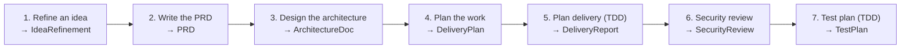

# Playbooks

A **Playbook** is a fixed chain of steps that produces a typed Artifact. It's the difference between asking a single conversational question and running an end-to-end workflow: discover → spec → launch, with each step's output feeding the next.

A single Conversations turn gets you a focused answer in seconds. A Playbook gets you a sectioned, sourced executive brief — and (usually) an artifact other playbooks can build on. They are different tools for different moments.

---

## The step kinds

Every playbook is built from these primitives:

| Kind | What it does | Roughly |
|---|---|---|
| **ASK** (`intent_turn`) | A single LLM call shaped by an Intent (e.g. *Write a PRD*, *Red-team — argue the opposite*) plus the active rubric, memory, and the prior step's outputs as context. | 5-20s · ~$0.02 |
| **DIVERGENT** (`divergent`) | Wild-ideation pass. Deliberately bypasses the convergence sources — no graph context, no rubric, temperature 1.0 — to generate raw candidate ideas. Used by *Find unexplored ideas*. | 20-40s · ~$0.04 |
| **DEBATE** (`foresight`) | A real ForeSight session: multi-persona, multi-round debate. Each persona sees the others' prior round and updates. Surfaces position changes — the highest-signal output. | 60-90s · ~$0.15 |
| **SIM** (`simulate`) | The lightweight 4-persona simulate (Bull / Bear / Customer / Competitor) — parallel, one round, no debate. Faster and cheaper than DEBATE; use when you want multi-perspective coverage without persona-update tracking. | 30-50s · ~$0.08 |
| **FACTCHECK** (`factcheck`, opt-in) | Extracts 5-10 atomic, load-bearing claims from prior step outputs and verifies each via web_search. Outputs a Markdown table classifying each: VERIFIED / PARTIALLY-VERIFIED / UNVERIFIED / CONTRADICTED / TIME-SENSITIVE. The SYNTH that follows weights by this. | 30-60s · ~$0.06 |
| **SYNTH** (`synthesize`) | The final pass. Reads every prior step's output and emits the typed Artifact: TL;DR, structured sections, sources, highlights. This is what the exec actually reads. Optionally wrapped in an inference strategy (see below). | 10-90s · ~$0.04-$0.15 |

ASK runs are cheap and serial. DIVERGENT generates wild candidates without the rubric filtering them prematurely. DEBATE is the big-bet step. SIM is the cheap-debate alternative. FACTCHECK is the verification step you turn on when the brief's claims need to be defensible. SYNTH closes the loop.

---

## The catalog — 17 built-in playbooks

The library splits into two tracks: **Strategy / Research** (10 playbooks → typed strategic artifacts) and **Brownfield AI-led Dev** (7 playbooks → typed engineering artifacts that chain end-to-end). Both tracks share the same step machinery and the same Artifact model.

### Strategy / Research track (10)

| Playbook | Output type | When to use it |
|---|---|---|
| **Find unexplored ideas** | OpportunityScan | You want the corpus to surface candidates you haven't thought of. Uses the DIVERGENT step. |
| **Discover product opportunities** | OpportunityScan | You don't have a candidate yet — surface ARR-shaped ones with corpus grounding. |
| **Pressure-test a strategy** | StrategyBrief | You have a strategic bet on the table and need to stress it. |
| **Product Strategy Director** | StrategyBrief | The deepest strategy playbook — multi-round, multi-persona, end-to-end strategy memo (~12 steps). |
| **Decide build vs buy vs partner** | BuildBuyDecision | You know the capability you want, not the path. |
| **Draft a PRD** | PRDDraft | The decision is made — produce an engineering-ready spec. |
| **Plan a launch (GTM)** | LaunchPlan | Feature/product is locked — produce the full launch kit. |
| **Codebase health check** | CodebaseAudit | Repo is ingested — structured audit before signing off. |
| **Audit KB freshness** | KBHealthReport | Find load-bearing claims in the corpus that are stale or contradicted; emits paste-ready refinements. |
| **Pre-mortem on a plan** | StrategyBrief | You're about to commit. Imagine it failed first. ~3 minutes. |

### Brownfield AI-led Dev chain (7) — designed to chain

These produce typed artifacts that feed into each other end-to-end, turning a vague idea into a shipping-ready spec + plan + tests, all grounded in an ingested codebase.



Each stage takes the prior artifact as its source-of-truth context. The chain is intentionally linear: Stage 3 reads Stage 2's PRD, Stage 4 reads the architecture, etc. Skip a stage and you'll get drift; run them in order and the test plan at the end actually knows what was specified at the start.

**Inter-playbook composition.** Beyond the brownfield chain, almost any artifact can seed a downstream playbook. Common moves: **Discover → PRD → Launch**, or **Pressure-test → BuildBuy → PRD**, or **anything → Pre-mortem before commit**. Pick a source artifact from the dropdown in the kickoff form and its TL;DR + sections inject into the first step's prompt.

---

## Artifact composition (why chaining matters)

Every playbook emits a typed Artifact (`OpportunityScan`, `StrategyBrief`, etc.). When you start a new playbook, the kickoff form offers compatible prior artifacts in a dropdown:

> *Build on a prior artifact (optional)*
> ▸ — none —
> ▸ "Cross-repo incident retrospective bundle" — OpportunityScan
> ▸ "Opsgenie migration window — Q3 2026" — StrategyBrief

Pick one and its **TL;DR + structured sections** get injected into the first step's prompt as context. The new playbook isn't blank — it's standing on the prior brief.

The graph above shows what feeds what. PRDs can be seeded by an OpportunityScan, a StrategyBrief, or a BuildBuyDecision. The Pre-mortem playbook accepts any prior artifact and stress-tests it.

**The chain you typically want for a new product**: Discover → PRD → Launch. Three playbooks, three artifacts, ~15 minutes of total LLM time. The PRD step picks up the Discover brief automatically; the Launch step picks up the PRD.

---

## Anatomy of a run

When you kick off a playbook you get a **run record** that lives on the server. It contains:

```
{
  id, playbook_id, status: queued | running | complete | failed,
  current_step, steps: [{ id, label, type, status, output, tokens, web_sources }, …],
  total_tokens, started_at, finished_at, final_artifact_id, error,
  user_inputs: { scenario, source_artifact_id, web_grounding }
}
```

Four things to know:

1. **Runs are server-side and persistent.** Close the laptop, the run continues. Come back, click the run in *Recent runs*, and the timeline picks up exactly where it left off.

2. **Each step writes its output as it completes.** You watch the timeline fill in — no big "loading" spinner that hides what's happening. If step 2's output looks wrong, you can see it before step 3 builds on it.

3. **Cancel + resume are supported.** Click *Cancel* on a running run and the worker stops at the next step boundary (mid-step LLM calls finish so tokens aren't wasted). The run record is preserved with all completed steps intact. Click *Resume* to pick up from the first non-complete step — earlier outputs are reused as-is, no re-billing.

4. **DEBATE steps create real ForeSight sessions.** They show up in the ForeSight tab too. If you want to inspect the debate transcript persona-by-persona, find the session there.

The final SYNTH step parses Claude's structured output and creates the Artifact. You see TL;DR → highlights → sections → sources, ready to copy into a deck or doc.

---

## Choosing between Playbooks and Conversations

| Use a **Playbook** when… | Use **Conversations** when… |
|---|---|
| You want a sectioned brief, not a chat answer | You want a focused answer to one question |
| You want artifacts other playbooks can build on | You're exploring; you don't know what you want yet |
| You're willing to spend 3-15 minutes for depth | You need an answer in 10-30 seconds |
| The work has a known structure (PRD, launch plan, decision) | The work doesn't fit a template |
| You want the multi-perspective debate baked in | One perspective is fine, you'll add more by hand |

Conversations is the surgical tool. Playbooks are the workflow tool. The same workspace gives you both — and persistent memory + rubrics apply to both.

---

## Rubric

Every playbook run takes an optional **Rubric** from the kickoff form. The rubric body — your company-specific framing (capital constraints, Sherlocking risk, regulatory tailwinds, etc.) — is folded into every step that touches an LLM: ASK, DEBATE personas, DEBATE synth, SIM personas, SIM synth, FACTCHECK, and the final SYNTH.

Without a rubric, the brief is generic. With one, every section is filtered through the rules you've authored. The kickoff form pre-selects your first rubric so the default doesn't silently drop it.

Rubric edits are immediate: changes in the Rubric manager apply to the next run.

---

## Synthesizer inference strategy

The final SYNTH step takes a strategy dropdown on the kickoff form:

| Strategy | Extra LLM calls | When to use |
|---|---|---|
| **none** (default) | 0 | Fast brief; trust the single pass. |
| **reflection** | +2 (critique → revise) | The brief will be acted on. Catches weak/unsupported claims the draft missed. |
| **CoVe** (chain-of-verification) | +2 (verify → revise) | Many factual claims you want the model to second-guess itself on. |
| **best of 3** | +3 (3 candidates → pick) | High-stakes brief where you want sampling variance smoothed. |

These only wrap the **SYNTH** — earlier steps stay single-pass to keep total time reasonable. Reflection roughly doubles SYNTH time and adds ~$0.05 per run; CoVe is similar; Best-of-3 quadruples SYNTH but produces a more stable result.

A reflection-wrapped SYNTH on a 5-step playbook takes the run from ~4 min to ~5 min and from ~$0.30 to ~$0.40. Cheap insurance for any brief headed to a board.

---

## Fact-check

The kickoff form has a **✅ Fact-check before SYNTH** toggle. When on, an additional FACTCHECK step is spliced in right before SYNTH:

1. The model reads every prior step's output and pulls out 5-10 atomic, falsifiable claims (dates, numbers, named events, regulatory deadlines, company facts) — skipping subjective claims.
2. For each claim, `web_search` runs and classifies the verdict.
3. A Markdown table is emitted (`Claim | Status | Source | Note`).
4. The SYNTH step is told: "A fact-check is in the prior outputs. Weight VERIFIED claims heavily. Exclude or invert CONTRADICTED. Hedge UNVERIFIED with words like 'reportedly'."

Concretely, a fact-checked brief will explicitly hedge or drop claims that didn't verify, instead of laundering them through the final TL;DR. The cost is ~30-60 extra seconds and ~$0.06.

**When to turn it on**:

- The brief will be shared up (board, investors, customers)
- The corpus contains contested or time-sensitive claims
- You're combining the brief with general-knowledge inferences (model bridging gaps the corpus doesn't cover)

**When to skip it**:

- Exploratory brainstorm where claim accuracy matters less than idea generation
- Pure codebase audits (claims are file-grounded; web search adds little)
- You're explicitly running an adversarial play (red_team, pre_mortem) where hedging defeats the point

---

## Time horizon

Every playbook run takes a **horizon** input from the kickoff form: `3 months`, `6 months`, `1 year` (default), `3 years`, or `5 years`. The horizon flows into every step — ASK steps get it injected as "Time horizon for this analysis: …" so the model reasons in the right time frame; DEBATE and SIM steps pass it to the underlying ForeSight/Simulate engines so watch indicators and persona reactions anchor to the right window.

Pick the horizon based on what's at stake:

| Decision | Horizon |
|---|---|
| Quarterly product/launch milestones | 3-6 months |
| Most strategic bets, PRDs, launch plans | 1 year |
| Platform / architecture / category positioning | 3 years |
| Generational bets, regulatory cycles, market formation | 5 years |

A 3-year horizon will produce broader watch indicators ("Atlassian ships native Operations parity by 2028") and more speculative ARR ranges. A 3-month horizon will produce sharper, weekly-cadence signals.

The Simulate primitive supports a subset (`6mo`, `1y`, `3y`); other horizons gracefully fall back to `1y` for the SIM step but the surrounding ASK and DEBATE steps honor the full range.

---

## Web grounding in playbooks

Toggle is on the kickoff form. When on, every step that supports web tools (ASK, DEBATE personas, DEBATE synth, SIM personas, SIM synth, SYNTH) gets the Anthropic `web_search` tool. The model is instructed to use it **only for time-sensitive facts** the corpus is silent on (current company status, regulatory dates, recent product releases) — not as a substitute for grounding in your docs.

Web-grounded runs are slower (sometimes 2× wall-clock) and ~30-50% costlier. Default is **on** for v1 because most exec briefs are time-sensitive. Switch it off for backward-looking analysis of a closed corpus.

---

## Reading the final brief

Every Artifact has the same shape:

- **TL;DR** — one sentence, the single takeaway. If this isn't useful, the run wasn't.
- **Sections** — each playbook defines its own (e.g. a PRDDraft has *Problem*, *User stories*, *Metrics*, *Risks*; a LaunchPlan has *ICP*, *Positioning*, *Pricing*, *T-30 / T-0 / T+30*). Read in order — they build.
- **Sources** — corpus citations (file.pdf) and web citations (web: domain.com), deduped across all steps.

A few patterns that work:

- **Lead with the TL;DR.** If a teammate asks "what did the playbook say?" the TL;DR is your answer. The sections are the backing.
- **Read sections out of order if you're triaging.** *Recommendation* and *Watch indicators* are usually the most actionable.
- **Trust convergence across steps.** When the SYNTH section echoes something the ASK step already said, that claim is doubly grounded. When SYNTH introduces a new claim that no prior step established, treat it with more skepticism — the model is filling in.

---

## What playbooks don't do

Honest about limits:

- **They don't fact-check themselves.** A 5-step chain at 90% per-step fidelity is ~59% end-to-end. By the SYNTH the brief reads more confident than it should be. Always sanity-check load-bearing claims — especially in the *Recommendation* and *ARR estimate* sections.
- **They don't deliver the work.** Drafting a PRD ≠ shipping a feature. Drafting a launch plan ≠ running the launch. A playbook produces *first drafts* for humans + their other tools to take the last mile (JIRA, GitHub, Notion, Slack, Salesforce).
- **They don't replace judgment on irreversible decisions.** Use the Pre-mortem playbook on anything before you commit budget or headcount. It costs $0.30 and 3 minutes; it's the cheapest insurance you'll buy.
- **They can't stop themselves mid-run.** Once a run starts it runs to completion. If you see step 2 going wrong, you can delete the run from *Recent runs* — the worker will finish writing then exit, but the artifact won't show up. (Mid-run cancellation is on the roadmap.)

---

## Tuning per workspace

The Playbooks kickoff form exposes:

- **Scenario question** — the prompt you're kicking off with
- **Time horizon** — 3mo / 6mo / 1y / 3y / 5y
- **Build on a prior artifact** — chain composition
- **Rubric** — pre-selects the first rubric in the workspace; pick a different one or `— none —`
- **Answer model** — Haiku 4.5 (fast/cheap) / Sonnet 4.6 (balanced, default) / Opus 4.7 (highest quality, slower)
- **Synth inference strategy** — none / reflection / CoVe / best of 3
- **Fact-check before SYNTH** — opt-in, adds ~$0.06 and 30-60s
- **Web grounding** — on by default

Workspace-level state that always applies and isn't per-run:

- **Persistent memory** is injected into every step. Edit the memory drawer to remove anything stale before kicking off a big run — drift is hard to undo once the brief is written.
- **The playbook's own step intents** are fixed (the playbook IS the intent composition); you can't swap an intent per run. To compose differently, run a different playbook — or clone the playbook into a custom one and edit its steps in the Playbook Builder.

---

## After the brief lands — refine, ask, simplify

Every Artifact ships with three actions you can take on it after the fact:

- **Comments + Refine.** Drop reviewer comments on any section or the document as a whole. Click *Refine* and the synthesizer re-runs with your comments folded in — the artifact gets a new version, prior versions preserved in the version history.
- **Follow-up Q&A.** Ask a question about the artifact ("what changed since the parent OpportunityScan?", "expand on Risk #3"). The answer goes into the artifact's Q&A history, attributed and timestamped. Useful for prep before sharing the brief up.
- **Simplify.** Generates a plain-language rewrite of the brief for a non-specialist reader. Useful for board memos or all-hands summaries.

Plus one cross-artifact action: **Suggest patch from parent.** When you have a child artifact (say, a PRDDraft) whose parent (an OpportunityScan) has been updated, click *Suggest patch* and the system diffs the parent versions and proposes targeted edits to the child. Doesn't mutate the child — proposes a suggestion you accept or reject.

---

## Gap analysis on every answer

Every step that produces prose (ASK, DEBATE personas + synth, SIM personas + synth, the final SYNTH) emits a structured *gap analysis* block alongside its prose. The UI renders it as a small amber-tinted "⚠ What the brain doesn't know yet" section under the answer. Each gap is required to name a *specific* missing fact — never generic "more research needed." Examples:

- *"Corpus is silent on Q1 2026 revenue (most recent figure: Q3 2025)"*
- *"Cited deadline (Feb 2 2026) not verified against a current regulatory source"*
- *"Only one source supports this claim; second corroboration absent"*

This is a baseline epistemic hedge that runs whether or not you turn on fact-check. Fact-check is the heavier, more expensive answer to "did the load-bearing claims actually verify?" Gap analysis is the cheap, always-on hedge for "what didn't the model see?"
