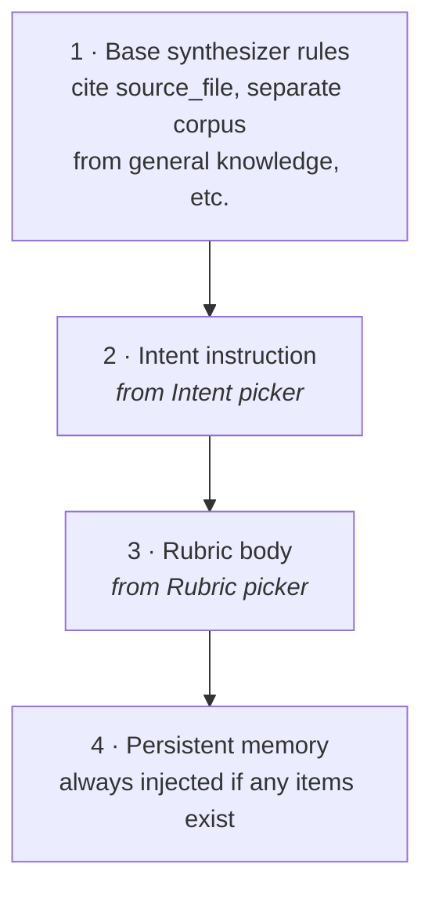
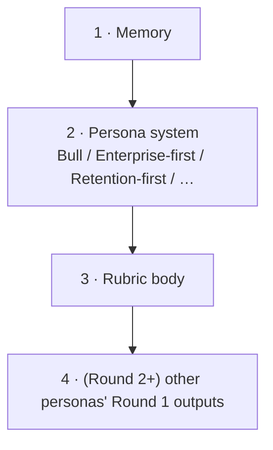

# Rubrics & Intents

Every Conversations turn (and every ForeSight persona) passes through two filters that shape what comes back: an **Intent** that determines the answer's *style*, and an optional **Rubric** that injects company-specific *evaluation rules*. They compose orthogonally — pick each independently.

This guide explains what they do, when to use each, and how to write good custom rubrics.

---

## Intent — the *style* of the answer

The Intent picker is a dropdown grouped by domain. Each entry injects a specific paragraph of instructions into the synthesizer's system prompt, shaping how it structures the answer. ~50 intents ship built-in across 7 groups, plus any custom ones you create.

**The 7 groups**

| Group | What's in it | Use when… |
|---|---|---|
| **Strategy / research** | `explore`, `product_idea`, `new_strategy`, `modify_strategy`, `pivot`, `evaluate`, `red_team`, `pre_mortem`, `analogues`, `competitor_scan`, `customer_voice`, `synthesize`, `find_gaps`, `moat_audit_present`, `moat_audit_future`, `path_to_win`, `external_scan`, `audit_claims`, `verify_load_bearing` (19 total) | Document corpora, strategy work, opportunity hunting, KB hygiene |
| **Existing product / codebase** | `explain_codebase`, `review_code`, `plan_refactor`, `plan_feature`, `security_audit`, `plan_migration`, `debug_issue` (7) | You've ingested a repo via the sidebar |
| **Product Manager** | `pm_spec`, `pm_user_stories`, `pm_risks`, `pm_dependencies`, `pm_prioritize`, `pm_build_buy_partner`, `pm_metrics` (7) | PRD / spec / roadmap work |
| **Engineering Manager** | `em_postmortem`, `em_capacity`, `em_interview`, `em_okrs`, `em_dependency_audit`, `em_test_coverage`, `em_technical_feasibility` (7) | Operational engineering decisions |
| **Growth** | `growth_experiment`, `growth_funnel`, `growth_activation`, `growth_pricing` (4) | Growth experiments and funnel work |
| **Brownfield AI-led dev** | `bf_idea_refine`, `bf_prd_brownfield`, `bf_architecture`, `bf_planning`, `bf_delivery`, `bf_security`, `bf_test_plan` (7) | The 7-step AI dev chain — turn an idea into shippable specs |
| **Go-to-Market** | `gtm_icp`, `gtm_positioning`, `gtm_pricing`, `gtm_channels`, `gtm_battlecard`, `gtm_enablement`, `gtm_beta`, `gtm_launch` (8) | Launch + sales enablement |

**Most-reached-for intents**

| Intent | What it makes the model do |
|---|---|
| **Explore** | Surface non-obvious connections and tensions in the corpus. Don't force a conclusion. |
| **Evaluate / pressure-test** | Identify load-bearing assumptions, failure modes, corpus evidence for/against. Skeptical without dismissive. |
| **Red-team — argue the opposite** | Argue the strongest case against. Three reasons in order of weight. End with the single signal that would change your mind. |
| **Pre-mortem — imagine it failed** | It's 12 months later and the plan failed. What went wrong? What did we miss? |
| **Find unexplored ideas** | Inventory existing themes, surface white space + bridges, propose adjacent ideas grounded in the corpus. |
| **Propose a new strategy** | Be opinionated. Primary bet + contingency. Investment size, time horizon, leading indicator. |
| **Explain this codebase** | Onboarding view — entry points, key modules, data flow, the 3-5 files to read first. |
| **Find a new product idea** | Per candidate: one-line description, ARR range, target buyer persona, biggest risk. |
| **Synthesize findings across documents** | Convergent / divergent / single-source claims. Where the corpus agrees vs disagrees. |
| **Write a PRD** | Engineering-ready spec — problem, scope, user stories, metrics, risks. |

For the full taxonomy with all ~50 intents and their instruction bodies, see **`INTENTS.md`** in the repo root or the **Intent Library** drawer in the app (gear icon next to the intent picker).

**Intent is small but high-leverage.** Without one, the model defaults to a generic helpful tone — long paragraphs, no clear structure. With one, the same question produces a sharply different shape of answer. Compare:

> *No intent:* "There are several promising opportunities. The Opsgenie migration looks interesting because..."
> *Intent = "Propose a new strategy":* "**Primary bet:** Opsgenie-exit migration bundle, $30-80M ARR target, 18-month build. **Contingency:** If Atlassian ships native JSM Operations parity by Q2 2026, redeploy to vertical regulated. **Investment:** $10-12M. **Watch:** Q1 2026 procurement velocity from existing Opsgenie customers."

Same model, same corpus — the intent pulled the structure out.

### How to pick

For documents/research workspaces:

- Don't have a clear question yet? → **Explore**.
- Want concrete decision input? → **Propose a new strategy** or **Pivot**.
- Need to stress-test something you already believe? → **Evaluate / pressure-test** or **Red-team**.
- About to commit and want a forward-looking risk pass? → **Pre-mortem**.
- Reading across multiple docs looking for patterns? → **Synthesize**.
- Want a list of options not a single answer? → **Find a new product idea** or **Find unexplored ideas**.
- Need a moat audit grounded in the graph? → **MOAT audit — present** or **MOAT audit — future**.

For codebase workspaces (you've ingested a repo):

- New to the code? → **Explain this codebase**.
- Need to find what's broken? → **Review code quality** (broad) or **Investigate a bug** (specific).
- About to change shape? → **Plan a refactor** (structure) or **Plan a feature addition** (additive).
- Security-focused review? → **Security audit**.
- Replacing a framework, lib, runtime, or schema? → **Plan a migration**.

For AI-led brownfield development (specs, ADRs, test plans):

- Walking an idea from concept to shipping spec? Use the **Brownfield AI dev** intent group sequentially — `bf_idea_refine` → `bf_prd_brownfield` → `bf_architecture` → `bf_planning` → `bf_delivery` → `bf_security` → `bf_test_plan`. The equivalent Playbook chains these automatically and produces typed artifacts at each step.

You can change the intent mid-conversation — the new turn uses the new intent. Useful when a thread starts as exploration and matures into "OK now propose."

### Customising intents — override, clone, restore

Built-in intents live in code so the UI can't drift from the backend. But you can still customise the behaviour without forking:

- **Override** — open any built-in intent in the Intent Library, edit the body, save. The system materialises an override scoped to your workspace (or globally). The built-in is untouched; future answers use your version.
- **Clone** — duplicate a built-in into a new ID, then edit freely. Useful when you want a *variant* (e.g. *"red_team but biased toward regulatory risk"*) rather than a workspace-wide replacement.
- **Restore default** — delete an override and the built-in reappears. The "Restore" button on each customised intent does exactly this.

The same override/clone/restore pattern applies to rubrics, playbooks, and ForeSight personas — it's the standard customisation pattern across the app.

---

## Rubric — the *rules* the answer must follow

A Rubric is reusable framing text — usually company-specific constraints, evaluation criteria, or stylistic rules — that gets folded into every turn that references it. Stored as a named JSON record; pick from a dropdown.

The app ships with one default rubric: **Appfire context (default)**. It includes:

1. **Capital constraints** — reject ideas needing >$200M up-front; prefer Motion B+ ($75–120M over 30 months).
2. **Sherlocking test** — if Atlassian could bundle it into Rovo/Compass/JSM, call out the risk explicitly.
3. **Distribution leverage** — favor ideas that pull through JMWE, BigPicture, Comala, Pluralsight Flow on the 200K+ Jira rail.
4. **Regulatory tailwinds** — treat hard deadlines (FDA QMSR Feb 2 2026, EU AI Act Aug 2 2026, CMMC DFARS Nov 10 2025, Opsgenie EOL Apr 5 2027) as forced-migration market drivers.
5. **Audit honesty** — cite source_file when grounded; flag general knowledge when not.
6. **Decisiveness** — prefer concrete recommendations with ARR / cost / timing over options-thinking.

That's it — 6 rules in plain language. The model treats them as constraints on every answer.

### Why rubrics matter

Without a rubric, a "propose a new strategy" answer about a $200M-ARR Atlassian Marketplace vendor will happily suggest a $1B horizontal-AI play. The model has no idea that's a capital mismatch. The rubric encodes that knowledge once, and every subsequent answer respects it.

You can see this play out across rubric on/off:

- *No rubric:* "Acquire Glean for $500M to dominate enterprise AI."
- *Appfire rubric:* "Glean acquisition violates the $200M capital ceiling (Rule 1). Consider the cheaper retention-moat play: extend Comala into AI-initiative governance (Rule 3, distribution leverage), targeting EU AI Act Aug 2 2026 deadline (Rule 4)."

Same question, fundamentally different answer — because the rubric ruled out a whole class of suggestions before the synthesizer started.

### When to create custom rubrics

The default Appfire rubric is good for Appfire-the-company. But you'll likely want others for:

- **A specific bet's framing** — e.g. *"Medical Device vertical only"*: rules about Class II/III, FDA QMSR, Comala-anchored, must include compliance citation.
- **An adversarial test** — e.g. *"Bear-mode review"*: rules that force the model to lead with failure modes, name the cheapest disprover, and refuse to estimate ARR without naming the load-bearing assumption.
- **A specific reader** — e.g. *"Board memo style"*: bullet points only, no prose, max 200 words, lead with the recommendation.
- **A teammate's preference** — e.g. *"Jamie's review style"*: numbered claims, citation per claim, opening sentence is the punchline.

A good rule of thumb: **if you find yourself adding the same context to multiple questions, write a rubric.**

### Writing a good custom rubric

Rubrics work best when they:

1. **Are specific to your context.** Generic rules like "be thorough" do nothing. "Reject any idea that requires a CISO buyer because Appfire has no enterprise security motion" is real.
2. **Are short.** 4–8 numbered rules, plain language. Long rubrics drift — the model loses attention by Rule 12.
3. **Include rejection criteria, not just preferences.** "Prefer ARR over costs" is weak. "If a recommendation lacks a specific ARR estimate, ask for one before continuing" is strong.
4. **State the *why* when the rule looks weird.** "Treat Atlassian Sherlocking as the default risk for any Marketplace feature, *because Code Barrel, Mindville, Halp, and Opsgenie all got absorbed*." The model honors rules better when it understands them.
5. **Match the model's hand.** Don't ask the model to verify legal compliance — it can't and won't. Do ask it to flag claims that *would need* legal review.

---

## How they compose with everything else

In a Conversations turn, the system prompt assembles in roughly this order:

Then the user message carries:
- Conversation history (last 8 turns)
- The new question
- Subgraph context (if graph-grounded)

For **ForeSight**, each persona gets the same stack plus their own viewpoint system prompt:

So if you run a ForeSight session with Intent="Pivot" + Rubric="Appfire context" + 5 personas, every persona is answering the same question through three filters: their viewpoint, the pivot-mode instructions, and the Appfire constraints. The synthesizer then sees all 5 + 3 rounds and produces the consolidated read.

That's a lot of channels — but each is independently togglable. If you want a model's raw take on a question, set Intent and Rubric both to *none*. If you want maximum constraint, layer everything.

---

## Practical recipes

A few combinations that work well:

| Goal | Intent | Rubric | Notes |
|---|---|---|---|
| Brainstorm new bets, no filter | Find a new product idea | none | Wide net, easy filter pass |
| Filter to Appfire's actual shape | Find a new product idea | Appfire context | Same brainstorm, capital-feasible only |
| Pressure-test a strategic claim | Evaluate / pressure-test | Appfire context | Bear-mode review with the company's constraints |
| Pivot conversation when something breaks | Consider a pivot | Appfire context | Forces the cheapest disprover |
| Get a clean board-memo answer | Propose a new strategy | (custom "Board memo style" rubric) | Right shape for sharing up |
| Synthesize what your team has been chasing | Synthesize | none | Surface convergence/divergence across docs without framing bias |

---

## Where to manage them

- **Intent**: dropdown in every conversation header. Also in the "New conversation" modal. Persisted per-thread.
- **Rubric**: dropdown in every conversation header. **"Manage rubrics"** button in the Conversations sidebar opens the editor — create, edit, delete custom ones. Presets cannot be deleted; you can duplicate them as a custom rubric for editing.

Both also exist on **ForeSight** sessions — same dropdowns in the builder, persisted on the session.

---

## What they don't fix

Honest about limits:

- **Rubrics don't make the model factual.** They constrain *shape*, not truth. A claim still needs to come from the corpus, the web (with grounding on), or general knowledge — the rubric just decides how to frame it.
- **Intents don't unlock new capabilities.** "Propose a new strategy" doesn't make the model better at strategy than it is; it just makes the strategy answers structured. Bad inputs still produce bad strategies, just with neater headings.
- **Rubrics drift on long answers.** If the model is producing 1200+ tokens, the early rules dominate; later sections sometimes ignore the rubric. For long-form work, the **Reflection** inference strategy is the fix — the critique pass catches rubric violations the draft missed.
- **The model doesn't enforce rubrics — it follows them probabilistically.** If a rule is critical (e.g. legal disclaimer), don't trust the rubric alone; check the output.

---

## Gap analysis — the always-on hedge

Every Conversations turn (and every Ask Graph answer) carries a structured **gap list** alongside the prose. It surfaces in the UI as a small amber-tinted "⚠ What the brain doesn't know yet" block under the answer, with 1–4 specific items.

Gap items are required to name a *concrete* missing or stale fact — never generic "more research needed." Examples:

- *"Corpus is silent on Q1 2026 revenue (most recent figure: Q3 2025)"*
- *"Cited deadline (Feb 2 2026) not verified against a current regulatory source"*
- *"Only one source supports this claim; second corroboration absent"*

This runs on every synthesizer call regardless of intent, rubric, or inference strategy — it's the built-in epistemic hedge against confident-sounding LLM prose. If the answer is genuinely well-grounded, the gap list is empty.

Each gap is one click from action: ingest a doc that closes it, run the *Audit KB freshness* playbook, or kick off web research.
