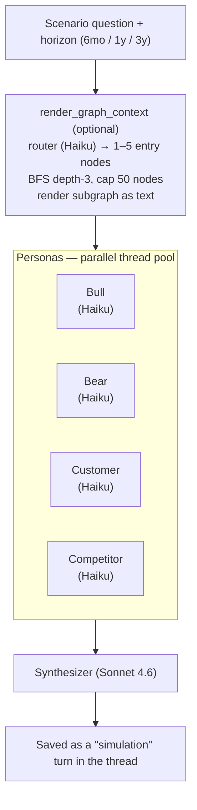
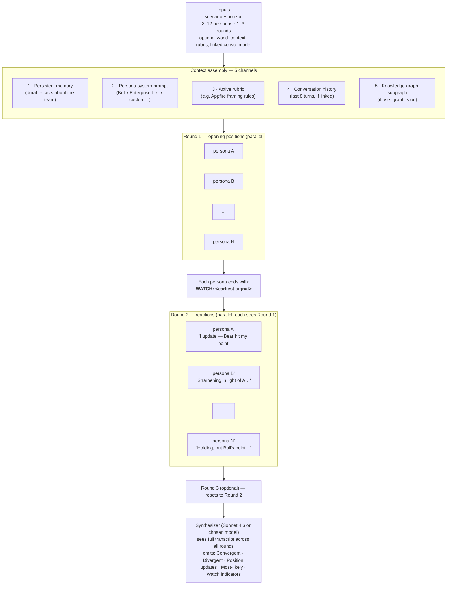

# The InnoBrain Simulation Pipeline

Two simulators ship in the app, deliberately separated by cost and depth. Both use the same core *idea* — multiple LLM agents react to a scenario from different viewpoints, then a synthesizer reconciles them — but the heavyweight one (ForeSight) adds debate rounds, configurable personas, and rich context. Here's how each works and how to read what comes back.

---

## Pipeline 1 — quick Simulate (in Conversations)

Lives in `simulate.py`. Triggered by the ⚡ Simulate button inside a thread. **One round, four fixed personas, parallel, ~$0.20, ~50s.**

**Token cost**: ~38K input, ~3.5K output. Each persona ~$0.03, synth ~$0.10.

---

## Pipeline 2 — ForeSight (the heavy one)

Lives in `foresight.py`. Triggered by 🔮 Advanced or "+ New simulation" in the ForeSight tab. **1–3 rounds, 11 preset personas + custom, debate, ~$0.20–0.50, ~60–90s.**

The 11 presets: **Bull** · **Bear** · **Customer** · **Competitor** · **Enterprise-first** · **Retention-first** · **Growth-first** · **Delivery-first** · **Platform-first** · **Regulator** · **Investor**. Each has its own viewpoint system prompt baked in. You can also define custom personas (label + tagline + system prompt + color) and they sit alongside the presets in the picker. Edits to a preset materialise as workspace overrides — restore-default brings the original back. Same override pattern as intents, rubrics, and playbooks.

**Token cost**: roughly `0.02 × personas × rounds + 0.05` USD. So 5 personas × 3 rounds ≈ $0.35.

The key difference vs. the quick version: in Round 2+, each persona is asked to *update or sharpen* their position based on what the others said. The synthesizer then explicitly tracks **who changed their mind and why** — that's signal the quick version cannot produce.

---

## How to interpret the result

The synthesis ships in five sections. Read them in this order; each tells you something specific.

### 1. Convergent claims
Things 2+ personas independently land on. **This is the highest-signal section.** When the Bear and the Competitor (who argue from opposite poles) both reach the same conclusion, that's near-certainty in the world the simulation modeled. The "Q3 2026 is dangerously late" claim in your earlier run is a good example — Bear and Competitor never coordinated, they both got there from their own logic.

### 2. Divergent claims
Where personas pull apart, with the *axes of disagreement* named. **This is your decision space.** Convergent claims tell you what's true; divergent claims tell you what's still bet-able. Look for binaries here — TAM size, win probability, capital sequencing — and ask: which side has the strongest evidence? Which side, if right, costs us more?

### 3. Position updates across rounds (debate-only)
Who changed their mind between Round 1 and Round 2, and what shifted them. **This is your evidence quality check.** If Bull updates *toward* Bear after seeing Bear's Ketryx evidence, that's a strong signal Bear's point survives scrutiny. If no one updates, the simulation didn't generate new information — you got parallel monologues, not a debate. (Lower-rounds runs often look like this; bump to 3 rounds for hard questions.)

### 4. Most-likely outcome
The synthesizer's single best forward prediction, **leaning toward a specific persona's view with the reason stated**. The reason matters more than the prediction. Read this as "given the convergent/divergent picture above, here is the most defensible bet" — not as a forecast you should trust uncritically.

### 5. Watch indicators
3–5 concrete observable signals in the next 30–90 days. **This is the operational output** — what to put on your dashboard. A good simulation produces indicators that are:

- **Falsifiable** (you'll actually know if they happened)
- **Cheap to observe** (no $50K research to check)
- **Time-bounded** (90 days max, not "by 2028")
- **Predictive of the most-likely outcome's branch** (the indicator tells you whether the prediction is playing out)

---

## How to *use* the result well

A few patterns that work:

**Look for asymmetric updates.** If Bull updates significantly toward Bear in Round 2 but Bear barely moves toward Bull, the simulation is telling you the bear case has more evidentiary weight than the bull case in this world. That's a stronger signal than just counting personas.

**Read the WATCH lines per persona, not just the final indicators.** The synthesizer's watch indicators are aggregated; the per-persona WATCH lines often catch things the synthesizer averages out. Especially the Competitor's WATCH — competitors imagine *what you'd see them doing*, which is often where you have the least line-of-sight.

**Trust convergence across opposing personas more than within-camp convergence.** Bull + Customer agreeing = predictable (both want the deal to work). Bear + Customer agreeing = much stronger signal (the buyer says the bear's failure mode would actually trigger their walk-away).

**Treat the most-likely outcome as a default, not a prediction.** It's the corpus's anchored guess. The real value is the watch indicators that would tell you to *deviate* from the default.

**Re-run with different rubrics for stress testing.** Same scenario, different framing rules → see which conclusions are robust to framing and which are framing artifacts.

---

## What the simulation does NOT do

Honest about limits:

- **It is not Monte Carlo.** No probability distributions, no sampling, no quantitative bands beyond what the personas claim. The "$12-20M ARR by Q2 2027" in your earlier run is a *single LLM-reasoned estimate*, not the mean of a distribution.
- **It can't predict events outside its training cutoff + your corpus + web grounding.** Geopolitical shocks, surprise M&A, regulatory reversals — invisible.
- **Persona stability is imperfect.** A persona will sometimes drift from their assigned viewpoint, especially in later rounds with strong opposing arguments. Read the persona names as styles, not consciousness.
- **Convergence is not consensus.** Personas converge partly because they read each other in Round 2+. A genuine consensus from independent sources is rarer; some of what looks like agreement is contagion.

---

## When to use which pipeline

| Use Quick Simulate when… | Use ForeSight when… |
|---|---|
| You want a quick second opinion mid-thread | The decision is stakes-worthy (≥$1M, hiring, multi-quarter commitment) |
| The 4 default personas (Bull/Bear/Customer/Competitor) cover the dimensions | You need Enterprise-first, Retention-first, Growth-first, Delivery-first, Platform-first, Investor, Regulator, or a custom viewpoint |
| You want one-round parallel takes | You want personas to debate and update |
| Cost matters more than depth | Position-update tracking is the key insight you need |

The reason ForeSight is separate isn't capability — it's commitment. A 5-persona × 3-round run costs about the same as a coffee but takes 90 seconds and produces 8K words of output. You don't want that on every casual question.

---

## ForeSight outputs are typed artifacts

Every ForeSight session emits a typed **ForesightBrief** artifact — the same Artifact model that Playbooks produce. That means a ForeSight session is durable: TL;DR + sections + sources, with versioning, reviewer comments, follow-up Q&A, and the *Refine* / *Simplify* actions all available the same way they are for any other artifact.

It also means ForeSight composes with Playbooks. A scenario you simulated in ForeSight can seed a downstream Playbook (e.g. *Decide build vs buy vs partner*) by picking the ForesightBrief in the kickoff form's "Build on a prior artifact" dropdown. The simulation's convergent claims + watch indicators get folded into the playbook's first step as grounding.

And the other direction: a Conversations thread can be **promoted to a ForeSight session** via the *🔮 simulate in ForeSight* button on any answer. The thread's recent turns + the user's question become the session scenario, and the conversation's intent + rubric pre-populate the session settings.
